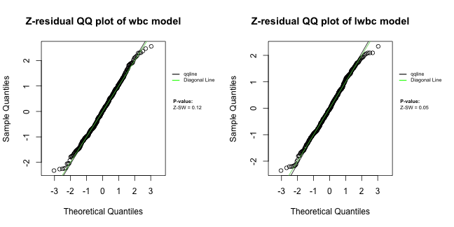

<!-- README.md is generated from README.Rmd. Please edit that file -->


# Z-residual

<!-- badges: start -->
<!-- badges: end -->

The Z-residual is residual diagnosis tool for diagnosing survival models and generalized linear models.


## Installation

You can install the development version of this package from [GitHub](https://github.com/) with:

```r
# install.packages("devtools")
devtools::install_github("tiw150/Zresidual")
```

## References
Li, L., Wu, T., Feng, C., 2021. Model Diagnostics for Censored Regression via Randomized Survival Probabilities. Statistics in Medicine, 2020+. https://doi.org/10.1002/sim.8852; https://onlinelibrary.wiley.com/share/author/F8DKBTX7IT7UT2WTSZP3?target=10.1002/sim.8852

Wu, T., Li, L., & Feng, C. (2023). Z-residual diagnostics for detecting misspecification of the functional form of covariates for shared frailty models. arXiv, page 2302.09106, 2023. Under review by Journal of Applied Statistics.
https://arxiv.org/abs/2302.09106


## Example

This example provides a fundamental illustration of using the Z-residuals for diagnosing both the overall goodness of fit (GOF) and the functional form of covariates in a real application for modelling the survival times of acute myeloid leukemia patients. 

The dataset employed in our analysis contains 411 patients who were recorded at the M. D. Anderson Cancer Center between 1980 and 1996. These patients were under the age of 60 and hailed from 24 administrative districts. The data collected information on the survival time for acute myeloid leukemia and prognostic factors, including  age, sex, white blood cell count (wbc) at diagnosis, and the townsend score (tpi) for which higher values indicate less affluent areas. The censoring rate is 29.2%. The response variable of interest is the survival time in days, which is the time from entry to the study or death. The preliminary study showed that the wbc is highly right-skewed. Logarithm transformation is often used to reduce the impact of extremely large values of the covariate on the response variable, such as the wbc variable in this application. However, a logarithm transformation may mask the impact of extremely large values of the covariate on the outcome variable. 


``` r
library(Zresidual)
#> 
#> Attaching package: 'Zresidual'
#> The following objects are masked _by_ '.GlobalEnv':
#> 
#>     drs, kidney, LeukSurv
#> The following object is masked from 'package:stats':
#> 
#>     residuals
library(survival)
#> 
#> Attaching package: 'survival'
#> The following object is masked _by_ '.GlobalEnv':
#> 
#>     kidney
library(EnvStats)
#> 
#> Attaching package: 'EnvStats'
#> The following objects are masked from 'package:stats':
#> 
#>     predict, predict.lm
#> The following object is masked from 'package:base':
#> 
#>     print.default
## basic example code
data("LeukSurv")
LeukSurv<-LeukSurv[LeukSurv$age<60,]
LeukSurv$district<-as.factor(LeukSurv$district)
LeukSurv$sex<-as.factor(LeukSurv$sex)
LeukSurv$logwbc<- log(LeukSurv$wbc+0.001)
```


```
#> Error in loadNamespace(name): there is no package called 'webshot'
```


We fitted two shared frailty models, one with covariates wbc, age, sex and tpi, which is labelled as the wbc model, and the other with log(wbc) replacing wbc, which is labelled as the lwbc model.


``` r
fit_LeukSurv_wbc <- coxph(Surv(time, cens) ~ age  +sex+ wbc +tpi  +
          frailty(district, distribution="gamma"), data= LeukSurv)
fit_LeukSurv_logwbc  <- coxph(Surv(time, cens) ~ age +sex + logwbc + tpi +
          frailty(district, distribution="gamma"), data= LeukSurv)

```

Once the model is fitted, we can calculate Z-residual, censored Z-residual and other residuals for two models.


``` r
Zresid.LeukSurv.wbc<-Zresidual(fit.object = fit_LeukSurv_wbc,nrep=1000)
Zresid.LeukSurv.logwbc<-Zresidual(fit.object = fit_LeukSurv_logwbc,nrep=1000)
```

Diagnosis of the overall (GOF) and the Functional Form of Covariates using Z-residuals

A QQ plot based on Z-residuals can be used to graphically assess the model's overall GOF, and Shapiro-Wilk (SW) or Shapiro-Francia (SF) normality tests applied to Z-residuals can be used to numerically test the overall GOF of the model.

We can see that the QQ plots of Z-residuals of these two models align well with the 45 $^\circ$ diagonal line. The Z-SW tests also give large p-values for two models, where Z-SW is the test method that the normality of Z-residuals is tested with the SW test.


``` r
par(mfrow = c(1,2),mar=c(4,4,2,2))
qqnorm.zresid(Zresid.LeukSurv.wbc,main.title = "Z-residual QQ plot of wbc model")
qqnorm.zresid(Zresid.LeukSurv.logwbc,main.title = "Z-residual QQ plot of lwbc model")
```

<div class="figure" style="text-align: center">

<p class="caption">Figure 1: QQ plots of Z-residuals for the wbc (left panels) and lwbc (right panels) models fitted to the survival data of acute myeloid leukemia patients</p>
</div>

The Z-residuals can be divided into $k$ groups by cutting the linear predictors or covariates into equally-spaced intervals. Then we can check whether the Z-residuals of the $k$ groups are homogeneously distributed. A quantitative method to assess the homogeneity of such grouped Z-residuals is to test the equality of group means or variances of the Z-residuals. We employ the F-test in ANOVA to assess the equality of means and Bartlett's test to examine the equality of variances.

The scatterplots of Z-residuals against the linear predictor don't exhibit visible trends; their LOWESS lines are very close to the horizontal line at 0; the boxplots of Z-residuals grouped by cutting  linear predictors into equal-spaced intervals appear to have equal means and variance across groups. The Z-AOV and Z-BL for linear predictors tests also gives large p-values for the wbc and lwbc models, where Z-AOV and Z-BL are the methods of applying ANOVA and Bartlett to test the equality of the means and variances of Z-residuals against the groups formed with the linear predictor.


``` r
par(mfrow = c(2,2),mar=c(4,4,1.5,2))
plot.zresid(Zresid.LeukSurv.wbc,
            main.title = "Z-residual Scatterplot of wbc model")
#> Error in if (X != "index") {: the condition has length > 1
plot.zresid(Zresid.LeukSurv.logwbc,
            main.title = "Z-residual Scatterplot of lwbc model")
#> Error in if (X != "index") {: the condition has length > 1

boxplot.zresid(Zresid.LeukSurv.wbc,
               main.title = "Z-residual Boxplot of wbc model")
#> Error in get(paste0(test.list[a], ".test.zresid"))(Zresidual, X, k.test): X must be the one of covariate name: age. X must be the one of covariate name: sex1. X must be the one of covariate name: wbc. X must be the one of covariate name: tpi.
boxplot.zresid(Zresid.LeukSurv.logwbc,
               main.title = "Z-residual Boxplot of lwbc model")
#> Error in get(paste0(test.list[a], ".test.zresid"))(Zresidual, X, k.test): X must be the one of covariate name: age. X must be the one of covariate name: sex1. X must be the one of covariate name: logwbc. X must be the one of covariate name: tpi.
```


The above diagnostics results reveal no serious misspecification in  these two models.  However, the inspection of the Z-residuals against the covariate wbc/log(wbc) reveals that the functional form of the lwbc model  is likely misspecified. The scatterplots and comparative boxplots of the Z-residuals against wbc/log(wbc)  are shown below. The LOWESS curve of the wbc model appears to align well with the horizontal line at 0 and the grouped Z-residuals of the wbc model appear to have equal means and variances across groups. However, the diagnosis results  for the lwbc model are very different. It appears that there is a non-linear trend in the LOWESS curve of the lwbc model and the grouped Z-residuals appear to have different means across groups. The Z-AOV and Z-BL for covariate wbc and log(wbc) also gives p-values for the wbc and lwbc models as shown in the boxplots. The very small p-value of the Z-AOV for covariate log(wbc) test for the lwbc models  strongly suggests that the log transformation of wbc is likely inappropriate for modelling the survival time. 


