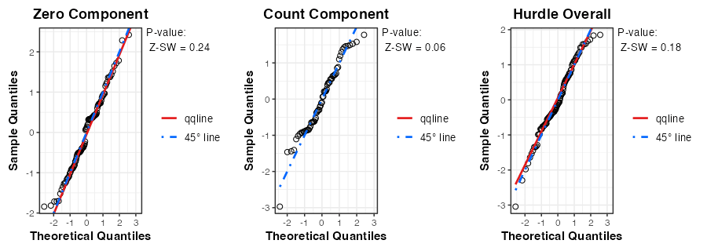
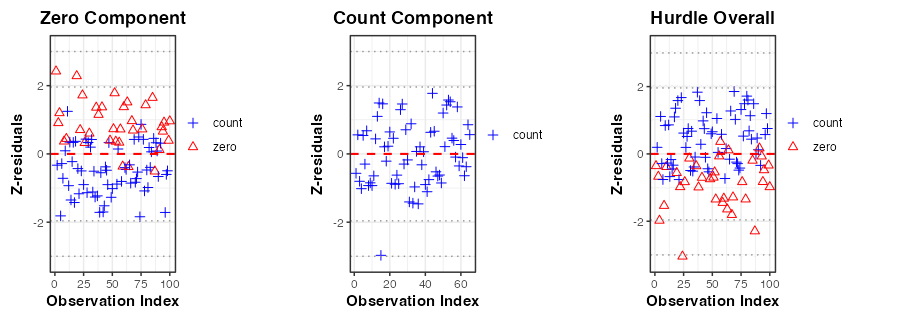
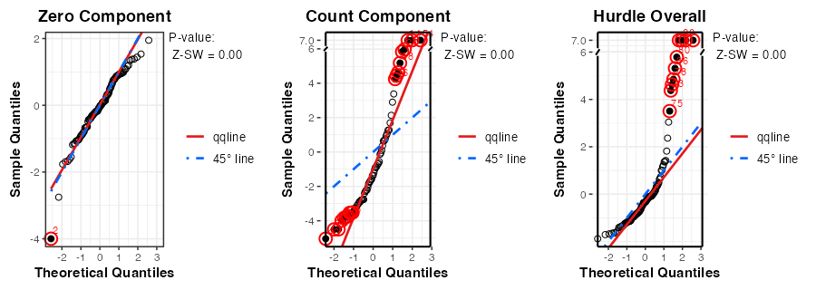
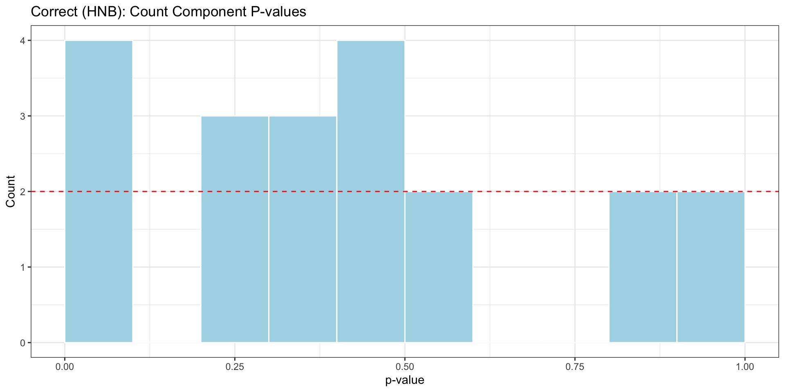
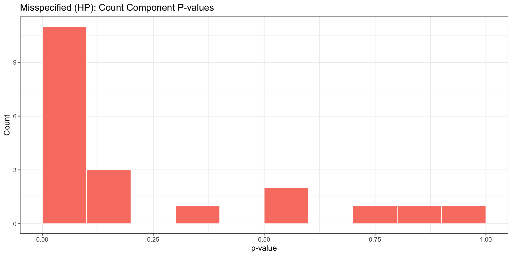

# Demo of Component-wise Z-residual Diagnosis for Bayesian Hurdle Models

## 1 Installing Zresidual and Required Packages

### 1.1 Installing Z-residual from Source (Developer Use)

Code

``` r
# For developer use to refresh the local installation
remove.packages("Zresidual")
devtools::document()
devtools::install()
```

### 1.2 Installing Z-residual from GitHub

Code

``` r
# if (!requireNamespace("Zresidual", quietly = TRUE)) {
#   if (!requireNamespace("remotes", quietly = TRUE)) install.packages("remotes")
#   remotes::install_github("tiw150/Zresidual", upgrade = "never", dependencies = TRUE)
# }
```

Code

``` r
library(Zresidual)
```

### 1.3 Intalling and Loading R Packages used in this Demo

Code

``` r
# Vector of required CRAN packages explicitly used in this demo
pkgs_cran <- c(
  "brms",            # For model fitting
  "rstan",           # Fallback backend for brms
  "distributions3", # For simulating truncated data
  "dplyr",           # For data manipulation and piping (%>%)
  "gt",              # For formatting tables
  "gifski",          # For rendering animated plots
  "ggplot2",         # Plotting backend used by Zresidual
  "gridExtra"        # Arranging multiple ggplot objects
)

missing_pkgs <- pkgs_cran[
  !vapply(pkgs_cran, requireNamespace, logical(1), quietly = TRUE)
]

if (length(missing_pkgs)) {
  message("Installing missing CRAN packages: ", paste(missing_pkgs, collapse = ", "))
  install.packages(missing_pkgs, dependencies = TRUE)
}

invisible(lapply(pkgs_cran, function(p) {
  suppressPackageStartupMessages(library(p, character.only = TRUE))
}))

# Use cmdstanr only if both the cmdstanr R package and CmdStan itself are available.
cmdstan_available <- FALSE

if (requireNamespace("cmdstanr", quietly = TRUE)) {
  cmdstan_path <- tryCatch(
    cmdstanr::cmdstan_path(),
    error = function(e) ""
  )

  cmdstan_available <- nzchar(cmdstan_path) && dir.exists(cmdstan_path)
}

if (cmdstan_available) {
  suppressPackageStartupMessages(library(cmdstanr))
  brms_backend <- "cmdstanr"
  message("Using brms backend: cmdstanr")
} else {
  brms_backend <- "rstan"
  message("Using brms backend: rstan")
  message("cmdstanr is not used because CmdStan path is not set.")
}

nc <- parallel::detectCores(logical = FALSE)
if (!is.na(nc) && nc > 1) {
  options(mc.cores = nc - 1)
}

brms_cores <- min(4, getOption("mc.cores", 1))
```

## 2 Introduction

This vignette demonstrates how to use the `Zresidual` package to compute
component-wise Z-residuals for diagnosing Bayesian hurdle models
([Mullahy 1986](#ref-Mullahy1986-em)). Based on the output from the
`brms` package in R ([Bürkner 2017](#ref-Burkner2017-brms)), Z-residuals
can be calculated separately for the zero, count, and overall hurdle
components to reveal potential model misspecifications.

To systematically illustrate this, we simulate 100 datasets from a
Hurdle Negative Binomial model and fit two models to each: a correctly
specified `HNB` model and a misspecified `HP` model. We evaluate a
single dataset comprehensively using visualizations, and then leverage
all 100 datasets to examine the sampling distribution of our diagnostic
p-values.

## 3 Definitions of Component-wise Z-residuals for Bayesian Hurdle Models

This section demonstrates the definiotns of component-wise posterior
predictive quantities including the posterior predictive `PMF`, survival
function, and `RPP` for Bayesian hurdle models. Hurdle models consist of
two parts:

- A **logistic component** modeling the probability of structural zeros.
- A **count component** modeling positive counts using a zero-truncated
  distribution.

Let C_i \in \\0, 1\\, where C_i = 1 indicates a non-zero value, and C_i
= 0 indicates a zero value for the i^\text{th} observations. If C_i=1,
the corresponding count model then operates on y_i^+ \in \\1, 2,
\dots\\, i.e., the positive counts only.

Using Bayesian estimation (e.g., via the `brms` package), we draw T
samples from the posterior distribution. Let \theta^{(t)} denote the
t^\text{th} posterior draw, including component-specific parameters
like:

- \pi^o_i : the zero probability,
- \mu_i^{(t)}, \phi^{(t)} : parameters for the count component.

For a given observation y_i^\text{obs}, the component-wise posterior
predictive `PMF` and survival functions are defined below.

#### 3.0.1 **Hurdle Model:**

p_i^{\text{post}, \pi^o_irdle}(y_i^\text{obs}) = \frac{1}{T}
\sum\_{t=1}^T \begin{cases} {\pi^o_i}^{(t)} & \text{if } y_i^\text{obs}
= 0, \\ (1 - {\pi^o_i}^{(t)}) \cdot\frac{p_i^\text{UT}(y_i^\text{obs} \|
\theta^{(t)})}{1 - p_i^\text{UT}(0 \| \theta^{(t)})} & \text{if }
y_i^\text{obs} =1, 2, \ldots,\\ 0 & \text{otherwise.} \end{cases}

S_i^{\text{post}, \pi^o_irdle}(y_i^\text{obs}) = \frac{1}{T}
\sum\_{t=1}^T \begin{cases} 1 & \text{if } y_i^\text{obs} \< 0, \\
1-{\pi^o_i}^{(t)} & \text{if } 0 \le y_i^\text{obs} \< 1, \\ (1 -
{\pi^o_i}^{(t)}) \cdot \frac{S_i^\text{UT}(y_i^\text{obs} \mid
\theta^{(t)})}{1-p_i^\text{UT}(0 \mid \theta^{(t)})} & \text{if }
y_i^\text{obs} \ge 1. \end{cases}

#### 3.0.2 **Logistic Component:**

p_i^{\text{post}, \text{logit}}(c_i^\text{obs}) = \frac{1}{T}
\sum\_{t=1}^T \begin{cases} {\pi^o_i}^{(t)} & \text{if } c_i^\text{obs}
= 0, \\ 1 - {\pi^o_i}^{(t)} & \text{if } c_i^\text{obs} = 1,\\ 0 &
\text{otherwise.} \end{cases} \tag{1}

S_i^{\text{post}, \text{logit}}(c_i^\text{obs}) = \frac{1}{T}
\sum\_{t=1}^T \begin{cases} 1 & \text{if } c_i^\text{obs} \< 0, \\
1-{\pi^o_i}^{(t)} & \text{if } 0 \le c_i^\text{obs} \< 1, \\ 0, &
\text{if } c_i^\text{obs} \ge 1. \end{cases} \tag{2}

#### 3.0.3 **Count Compoenent:**

p_i^{\text{post},\text{count}}({y_i^+}^\text{obs}) = \frac{1}{T}
\sum\_{t=1}^T \begin{cases} \frac{p_i^\text{UT}({y_i^+}^\text{obs} \mid
\theta^{(t)})}{1 - p_i^\text{UT}(0 \mid \theta^{(t)})}, & \text{ for }
{y_i^{+}}^\text{obs} = 1,2,\ldots,\\ 0 & \text{ otherwise.} \end{cases}
\tag{3}

S_i^{\text{post}, \text{count}}({y_i^+}^\text{obs}) = \frac{1}{T}
\sum\_{t=1}^T \begin{cases} 1 & \text{ if } {y_i^+}^\text{obs} \< 1 \\
\frac{S_i^\text{UT}({y_i^+}^\text{obs} \mid
\theta^{(t)})}{1-p_i^\text{UT}(0 \mid \theta^{(t)})}, & \text{ if }
{y_i^+}^\text{obs} \ge 1 \end{cases} \tag{4}

where p_i^\text{UT}(. \mid \theta^{(t)}) and S_i^\text{UT}(. \mid
\theta^{(t)}) denote the `PMF` and survival function of the untruncated
count distribution.

For any observed value y_i^\text{obs}, we define:
\text{rsp}\_i(y_i^\text{obs} \| \theta^{(t)}) = S_i(y_i^\text{obs} \|
\theta^{(t)}) + U_i \times p_i(y_i^\text{obs} \| \theta^{(t)}) \tag{5}
where U_i \sim \text{Uniform}(0,1). Then, the Z-residual of a discrete
response variable is: z_i =
-\Phi^{-1}(\text{rsp}\_i(y_i^\text{obs}\|\theta)) \sim N(0, 1) \tag{6}

## 4 Preparation: Data Simulation and Model Caching

We simulate 100 datasets from a Hurdle Negative Binomial (`HNB`)
process. For each dataset, we fit two models: 1. **Correct Model:**
Hurdle Negative Binomial (`family = hurdle_negbinomial()`). 2.
**Misspecified Model:** Hurdle Poisson (`HP`), approximated by forcing a
very tight prior on the shape parameter (`prior("normal(1000, 1)")`),
which causes the negative binomial to heavily resemble a Poisson
distribution, restricting overdispersion.

Because MCMC sampling is computationally expensive, we execute and cache
these 200 model fits to disk.

Code

``` r
 n_sim <- 20
 n_sample <- 100
 sim_data <- vector("list", n_sim)

 for(i in 1:n_sim) {

   data_file <- paste0(model_dir, "/data_sim_", i, ".rds")
   wrong_model_file <- paste0(model_dir, "/wrong_sim_", i, ".rds")
   correct_model_file <- paste0(model_dir, "/correct_sim_", i, ".rds")

   #   # --- 1. Check and Handle Data ---
   if (!force_refit && file.exists(data_file)) {
     sim_data[[i]] <- readRDS(data_file)
   } else {
     x <- rnorm(n_sample)
     z <- rnorm(n_sample)

     # Hurdle (zero) part
     logit_p <- -1 - 1 * x
     p_zero <- exp(logit_p) / (1 + exp(logit_p))
     zeros <- rbinom(n_sample, 1, p_zero)

     # Count (non-zero) part
     # FIX: Lowered intercept and slope to prevent exp() overflow
     log_mu <- 1.5 + 2 * x
     mu <- exp(log_mu)
     size <- 6

     # Generate from zero-truncated negative binomial
     prob <- size / (size + mu)
     y <- (1 - zeros) * distributions3::rztnbinom(n_sample, size, prob)

     dat_i <- data.frame(y = y, x = x, z = z)
     sim_data[[i]] <- dat_i
     saveRDS(dat_i, file = data_file)
   }

   # --- 2. Check and Fit Misspecified Model (HP Approx) ---
   if (force_refit || !file.exists(wrong_model_file)) {
     tryCatch({
       brms::brm(
         bf(y ~ x + z, hu ~ x + z),
         family = hurdle_negbinomial(),
         prior = prior("normal(1000, 1)", class = "shape"),
         data = sim_data[[i]],
         backend = brms_backend,
         file = paste0(model_dir, "/wrong_sim_", i),
         refresh = 0,
         cores = 4,
         # Optional: tighten control parameters for the tricky prior
         control = list(adapt_delta = 0.95)
       )
     }, error = function(e) {
       message(sprintf("Iteration %d: Wrong model failed to fit - %s", i, e$message))
     })
   }

   # --- 3. Check and Fit Correct Model (HNB) ---
   if (force_refit || !file.exists(correct_model_file)) {
     tryCatch({
       brms::brm(
         bf(y ~ x + z, hu ~ x + z),
         family = hurdle_negbinomial(),
         data = sim_data[[i]],
         backend = brms_backend,
         file = paste0(model_dir, "/correct_sim_", i),
         refresh = 0,
         cores = 4
       )
     }, error = function(e) {
       message(sprintf("Iteration %d: Correct model failed to fit - %s", i, e$message))
     })
   }
 }
```

## 5 Single Dataset Evaluation

Let’s load the first dataset to demonstrate `Zresidual` directly. We
compute Z-residuals for both models separately across the logistic
(zero), count, and overall hurdle components using the `"post"` summary
method. Notice that `type` and `mcmc_summarize` are passed directly as
arguments to
[`Zresidual()`](https://tiw150.github.io/Zresidual/reference/Zresidual.md).

Code

``` r
dat <- readRDS(paste0(model_dir, "/data_sim_2.rds"))

fit_correct <- brm(bf(y ~ x + z, hu ~ x + z), family = hurdle_negbinomial(), data = dat, backend = brms_backend, file = paste0(model_dir, "/correct_sim_2"))

fit_wrong <- brm(bf(y ~ x + z, hu ~ x + z), family = hurdle_negbinomial(), prior = prior("normal(1000, 1)", class = "shape"), data = dat, backend = brms_backend, file = paste0(model_dir, "/wrong_sim_2"))
```

### 5.1 Computing Z-residuals

Code

``` r
# Correct Model (HNB) Z-residuals and Covariates
zres_c_hurdle <- Zresidual(fit_correct, data = dat,  mcmc_summarize = "post", randomized = TRUE, nrep = 10)
zcov_c_hurdle <- Zcov(fit_correct, data = dat)

# Misspecified Model (HP) Z-residuals and Covariates
zres_w_hurdle <- Zresidual(fit_wrong, data = dat, mcmc_summarize = "post", randomized = TRUE, nrep = 10)
zcov_w_hurdle <- Zcov(fit_wrong, data = dat)
```

Code

``` r
# Correct Model (HNB) Z-residuals and Covariates
zres_c_count  <- Zresidual(fit_correct, data = dat, type = "count",  mcmc_summarize = "post", randomized = TRUE, nrep = 10)
zcov_c_count  <- Zcov(fit_correct, data = dat, type = "count")

# Misspecified Model (HP) Z-residuals and Covariates
zres_w_count  <- Zresidual(fit_wrong, data = dat, type = "count",  mcmc_summarize = "post", randomized = TRUE, nrep = 10)
zcov_w_count  <- Zcov(fit_wrong, data = dat, type = "count")
```

Code

``` r
# Correct Model (HNB) Z-residuals and Covariates
zres_c_zero   <- Zresidual(fit_correct, data = dat, type = "zero",   mcmc_summarize = "post", randomized = TRUE, nrep = 10)
zcov_c_zero   <- Zcov(fit_correct, data = dat, type = "zero")

# Misspecified Model (HP) Z-residuals and Covariates
zres_w_zero   <- Zresidual(fit_wrong, data = dat, type = "zero",   mcmc_summarize = "post", randomized = TRUE, nrep = 10)
zcov_w_zero   <- Zcov(fit_wrong, data = dat, type = "zero")
```

### 5.2 True Model Diagnostics (HNB)

The following animations show component-wise QQ plots over 10 randomized
replicates for the correctly specified model.

Code

``` r
gif_qq_path_c <- file.path(
  model_dir,
  "hnb_qqplot_ggplot_v2.gif"
)

if (force_rerun || !file.exists(gif_qq_path_c)) {

  n_frames_c <- min(
    10L,
    ncol(zres_c_zero),
    ncol(zres_c_count),
    ncol(zres_c_hurdle)
  )

  frame_dir <- tempfile("hnb_qq_frames_")
  dir.create(frame_dir)

  frame_files <- file.path(
    frame_dir,
    sprintf("frame_%03d.png", seq_len(n_frames_c))
  )

  grDevices::pdf(file = NULL)

  for (i in seq_len(n_frames_c)) {

    qq_zero <- qqnorm(
      zres_c_zero,
      zcov = zcov_c_zero,
      irep = i,
      main.title = "Zero Component"
    )$plots[[1L]]

    qq_count <- qqnorm(
      zres_c_count,
      zcov = zcov_c_count,
      irep = i,
      main.title = "Count Component"
    )$plots[[1L]]

    qq_hurdle <- qqnorm(
      zres_c_hurdle,
      zcov = zcov_c_hurdle,
      irep = i,
      main.title = "Hurdle Overall"
    )$plots[[1L]]

    combined_plot <- gridExtra::arrangeGrob(
      grobs = list(qq_zero, qq_count, qq_hurdle),
      ncol = 3
    )

    ggplot2::ggsave(
      filename = frame_files[i],
      plot = combined_plot,
      width = 9,
      height = 3.2,
      units = "in",
      dpi = 100,
      bg = "white"
    )
  }

  grDevices::dev.off()

  gif_temp <- tempfile(fileext = ".gif")

  gifski::gifski(
    png_files = frame_files,
    gif_file = gif_temp,
    width = 900,
    height = 320,
    delay = 0.8,
    loop = TRUE
  )

  copied <- file.copy(
    from = gif_temp,
    to = gif_qq_path_c,
    overwrite = TRUE
  )

  if (!copied) {
    stop("Failed to copy the HNB Q-Q animation.")
  }

  unlink(frame_dir, recursive = TRUE)
  unlink(gif_temp)
}

knitr::include_graphics(gif_qq_path_c)
```



Figure 1: True Model: Z-residual Q-Q plots over 10 randomization
replicates. Left to right: Zero, Count, and Hurdle components.

As expected, all residual points align cleanly with the 45-degree normal
reference line.

Code

``` r
gif_scatter_path_c <- file.path(
  model_dir,
  "hnb_scatterplot_ggplot_v2.gif"
)

if (force_rerun || !file.exists(gif_scatter_path_c)) {

  n_frames_c <- min(
    10L,
    ncol(zres_c_zero),
    ncol(zres_c_count),
    ncol(zres_c_hurdle)
  )

  frame_dir <- tempfile("hnb_scatter_frames_")
  dir.create(frame_dir)

  frame_files <- file.path(
    frame_dir,
    sprintf("frame_%03d.png", seq_len(n_frames_c))
  )

  grDevices::pdf(file = NULL)

  for (i in seq_len(n_frames_c)) {

    scatter_zero <- plot(
      zres_c_zero,
      zcov = zcov_c_zero,
      irep = i,
      x_axis_var = "index",
      main.title = "Zero Component",
      xlab = "Observation Index",
      ylab = "Z-residuals"
    ) +
      ggplot2::geom_hline(
        yintercept = 0,
        colour = "red",
        linetype = 2,
        linewidth = 0.7
      )

    scatter_count <- plot(
      zres_c_count,
      zcov = zcov_c_count,
      irep = i,
      x_axis_var = "index",
      main.title = "Count Component",
      xlab = "Observation Index",
      ylab = "Z-residuals"
    ) +
      ggplot2::geom_hline(
        yintercept = 0,
        colour = "red",
        linetype = 2,
        linewidth = 0.7
      )

    scatter_hurdle <- plot(
      zres_c_hurdle,
      zcov = zcov_c_hurdle,
      irep = i,
      x_axis_var = "index",
      main.title = "Hurdle Overall",
      xlab = "Observation Index",
      ylab = "Z-residuals"
    ) +
      ggplot2::geom_hline(
        yintercept = 0,
        colour = "red",
        linetype = 2,
        linewidth = 0.7
      )

    combined_plot <- gridExtra::arrangeGrob(
      grobs = list(
        scatter_zero,
        scatter_count,
        scatter_hurdle
      ),
      ncol = 3
    )

    ggplot2::ggsave(
      filename = frame_files[i],
      plot = combined_plot,
      width = 9,
      height = 3.2,
      units = "in",
      dpi = 100,
      bg = "white"
    )
  }

  grDevices::dev.off()

  gif_temp <- tempfile(fileext = ".gif")

  gifski::gifski(
    png_files = frame_files,
    gif_file = gif_temp,
    width = 900,
    height = 320,
    delay = 0.8,
    loop = TRUE
  )

  copied <- file.copy(
    from = gif_temp,
    to = gif_scatter_path_c,
    overwrite = TRUE
  )

  if (!copied) {
    stop("Failed to copy the HNB scatterplot animation.")
  }

  unlink(frame_dir, recursive = TRUE)
  unlink(gif_temp)
}

knitr::include_graphics(gif_scatter_path_c)
```



Figure 2: True Model: Z-residual scatterplots over 10 randomization
replicates. Left to right: Zero, Count, and Hurdle components.

### 5.3 Misspecified Model Diagnostics (HP)

When we fit the `HP` model to the `HNB` data, we expect the zero
component to be fine (since the logistic function is identical), but the
count and overall hurdle components to show overdispersion
misspecification.

Code

``` r
gif_qq_path_w <- file.path(
  model_dir,
  "hp_qqplot_ggplot_v2.gif"
)

if (force_rerun || !file.exists(gif_qq_path_w)) {

  n_frames_w <- min(
    10L,
    ncol(zres_w_zero),
    ncol(zres_w_count),
    ncol(zres_w_hurdle)
  )

  frame_dir <- tempfile("hp_qq_frames_")
  dir.create(frame_dir)

  frame_files <- file.path(
    frame_dir,
    sprintf("frame_%03d.png", seq_len(n_frames_w))
  )

  grDevices::pdf(file = NULL)

  for (i in seq_len(n_frames_w)) {

    qq_zero <- qqnorm(
      zres_w_zero,
      zcov = zcov_w_zero,
      irep = i,
      main.title = "Zero Component"
    )$plots[[1L]]

    qq_count <- qqnorm(
      zres_w_count,
      zcov = zcov_w_count,
      irep = i,
      main.title = "Count Component"
    )$plots[[1L]]

    qq_hurdle <- qqnorm(
      zres_w_hurdle,
      zcov = zcov_w_hurdle,
      irep = i,
      main.title = "Hurdle Overall"
    )$plots[[1L]]

    combined_plot <- gridExtra::arrangeGrob(
      grobs = list(qq_zero, qq_count, qq_hurdle),
      ncol = 3
    )

    ggplot2::ggsave(
      filename = frame_files[i],
      plot = combined_plot,
      width = 9,
      height = 3.2,
      units = "in",
      dpi = 100,
      bg = "white"
    )
  }

  grDevices::dev.off()

  gif_temp <- tempfile(fileext = ".gif")

  gifski::gifski(
    png_files = frame_files,
    gif_file = gif_temp,
    width = 900,
    height = 320,
    delay = 0.8,
    loop = TRUE
  )

  copied <- file.copy(
    from = gif_temp,
    to = gif_qq_path_w,
    overwrite = TRUE
  )

  if (!copied) {
    stop("Failed to copy the HP Q-Q animation.")
  }

  unlink(frame_dir, recursive = TRUE)
  unlink(gif_temp)
}

knitr::include_graphics(gif_qq_path_w)
```



Figure 3: Misspecified Model: Z-residual Q-Q plots over 10 randomization
replicates. Left to right: Zero, Count, and Hurdle components.

The component-wise approach clearly isolates the error: the
zero-component matches the data, while the count-component displays
severe S-curve deviations typical of unmodeled variance
(overdispersion).

### 5.4 Statistical Test Comparisons

We evaluate the models computationally by summarizing the `SW`, `ANOVA`,
and `BL` tests across components.

Code

``` r
# Function to extract mean p-values across replicates
get_pvals <- function(zres, zcov) {
  c(
    SW = mean(as.numeric(sw.test.zresid(zres))),
    AOV = mean(as.numeric(aov.test.zresid(zres, X = "lp", zcov = zcov))),
    BL = mean(as.numeric(bartlett.test.zresid(zres, X = "lp", zcov = zcov)))
  )
}

res_c_zero <- get_pvals(zres_c_zero, zcov_c_zero)
res_c_count <- get_pvals(zres_c_count, zcov_c_count)
res_c_hurdle <- get_pvals(zres_c_hurdle, zcov_c_hurdle)

res_w_zero <- get_pvals(zres_w_zero, zcov_w_zero)
res_w_count <- get_pvals(zres_w_count, zcov_w_count)
res_w_hurdle <- get_pvals(zres_w_hurdle, zcov_w_hurdle)

table_df <- data.frame(
  Component = c("Logistic (Zero)", "Count (+)", "Overall Hurdle"),
  HNB_SW = c(res_c_zero["SW"], res_c_count["SW"], res_c_hurdle["SW"]),
  HNB_AOV = c(res_c_zero["AOV"], res_c_count["AOV"], res_c_hurdle["AOV"]),
  HNB_BL = c(res_c_zero["BL"], res_c_count["BL"], res_c_hurdle["BL"]),
  HP_SW = c(res_w_zero["SW"], res_w_count["SW"], res_w_hurdle["SW"]),
  HP_AOV = c(res_w_zero["AOV"], res_w_count["AOV"], res_w_hurdle["AOV"]),
  HP_BL = c(res_w_zero["BL"], res_w_count["BL"], res_w_hurdle["BL"])
)

table_df %>%
  gt() %>%
  tab_spanner(label = "Correct (HNB) p-values", columns = starts_with("HNB_")) %>%
  tab_spanner(label = "Misspecified (HP) p-values", columns = starts_with("HP_")) %>%
  cols_label(
    HNB_SW = "Shapiro-Wilk", HNB_AOV = "ANOVA", HNB_BL = "Bartlett",
    HP_SW = "Shapiro-Wilk", HP_AOV = "ANOVA", HP_BL = "Bartlett"
  ) %>%
  fmt_number(columns = -Component, decimals = 4) %>%
  cols_align(align = "center", columns = everything()) %>%
  tab_style(
    style = cell_text(weight = "bold", color = "red"),
    locations = cells_body(columns = starts_with("HP_"), rows = Component != "Logistic (Zero)")
  ) %>%
  tab_options(table.width = pct(100), table.font.size = px(14))
```

[TABLE]

The table confirms our visual inspection. The correctly specified HNB
model yields uniformly high p-values across all tests and components.
For the misspecified HP model, the Logistic (Zero) component remains
valid, but the Count component triggers massively significant failures,
appropriately failing the overall Hurdle tests.

## 6 Checking the Sampling Distribution of ANOVA tests

To prove this behavior isn’t an artifact of our single chosen dataset,
we analyze the sampling distribution of the `ANOVA` p-values across all
100 simulated datasets.

Since the misspecification lies solely in the variance of the non-zero
outcomes, we isolate the `Zresidual(..., type="count")` diagnostics for
this analysis.

Code

``` r
ana_res_file <- paste0(model_dir, "/ana_pvalues.rds")

if (!force_recalcz && file.exists(ana_res_file)) {
  res <- readRDS(ana_res_file)
  p_c <- res$p_c
  p_w <- res$p_w
} else {
  p_c <- numeric(n_sim)
  p_w <- numeric(n_sim)
  
  for(i in 1:n_sim) {
    dat_sim <- readRDS(paste0(model_dir, "/data_sim_", i, ".rds"))
    
    # Extract Misspecified Model (HP)
    fit_w_sim <- brm(bf(y ~ x + z, hu ~ x + z), family = hurdle_negbinomial(), prior = prior("normal(1000, 1)", class = "shape"), data = dat_sim, backend = brms_backend, file = paste0(model_dir, "/wrong_sim_", i), refresh = 0)
    z_w_sim <- Zresidual(fit_w_sim, data = dat_sim, type = "count", mcmc_summarize = "post", randomized = TRUE, nrep = 1)
    zcov_w_sim <- Zcov(fit_w_sim, data = dat_sim, type = "count")
    p_w[i] <- as.numeric(aov.test.zresid(z_w_sim, X = "lp", zcov = zcov_w_sim))
    
    # Extract Correct Model (HNB)
    fit_c_sim <- brm(bf(y ~ x + z, hu ~ x + z), family = hurdle_negbinomial(), data = dat_sim, backend = brms_backend, file = paste0(model_dir, "/correct_sim_", i), refresh = 0)
    z_c_sim <- Zresidual(fit_c_sim, data = dat_sim, type = "count", mcmc_summarize = "post", randomized = TRUE, nrep = 1)
    zcov_c_sim <- Zcov(fit_c_sim, data = dat_sim, type = "count")
    p_c[i] <- as.numeric(aov.test.zresid(z_c_sim, X = "lp", zcov = zcov_c_sim))
  }
  
  saveRDS(list(p_c = p_c, p_w = p_w), ana_res_file)
}
```

Code

``` r
p_correct <- ggplot(data.frame(p_value = p_c), aes(x = p_value)) +
  geom_histogram(breaks = seq(0, 1, by = 0.1),
                 fill = "lightblue", colour = "white") +
  geom_hline(yintercept = n_sim / 10, colour = "red", linetype = 2) +
  labs(title = "Correct (HNB): Count Component P-values",
       x = "p-value", y = "Count") +
  theme_bw()

p_wrong <- ggplot(data.frame(p_value = p_w), aes(x = p_value)) +
  geom_histogram(breaks = seq(0, 1, by = 0.1),
                 fill = "salmon", colour = "white") +
  labs(title = "Misspecified (HP): Count Component P-values",
       x = "p-value", y = "Count") +
  theme_bw()

p_correct
p_wrong
```





The resulting histograms validate the methodology: the correctly
specified model generates uniformly distributed p-values across
datasets, while the component-wise test on the misspecified model
correctly and consistently flags the overdispersion defect with low
p-values.

## 7 References

Bürkner, Paul-Christian. 2017. “brms: An R Package for Bayesian
Multilevel Models Using Stan.” *Journal of Statistical Software* 80 (1):
1–28. <https://doi.org/10.18637/jss.v080.i01>.

Mullahy, John. 1986. “Specification and Testing of Some Modified Count
Data Models.” *J. Econom.* 33 (3): 341–65.
