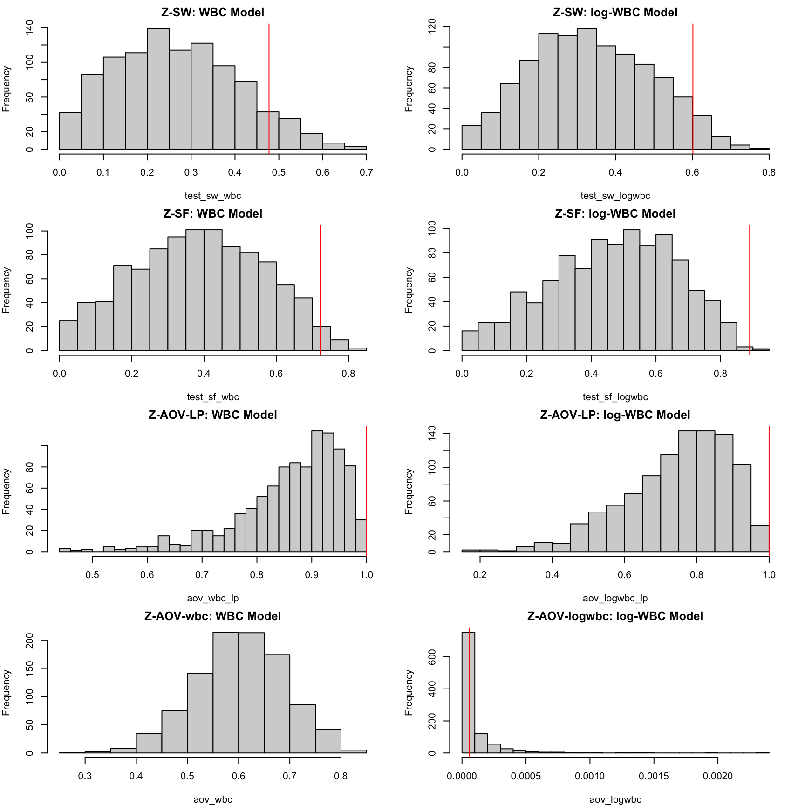
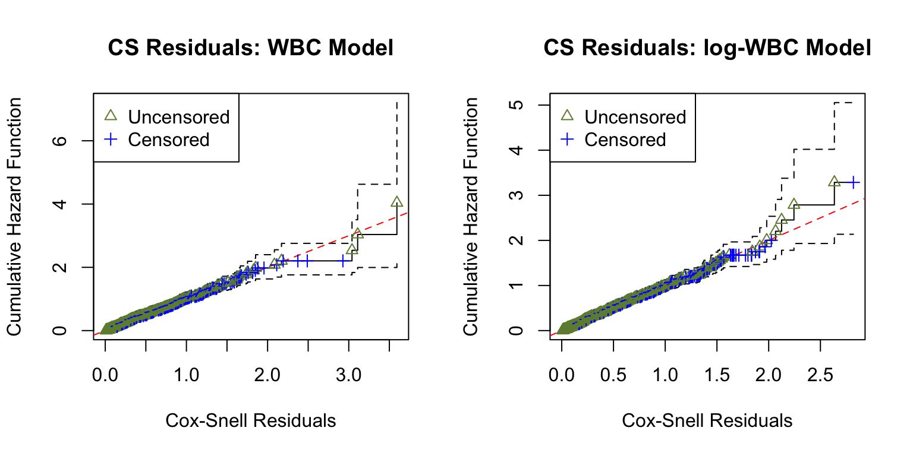
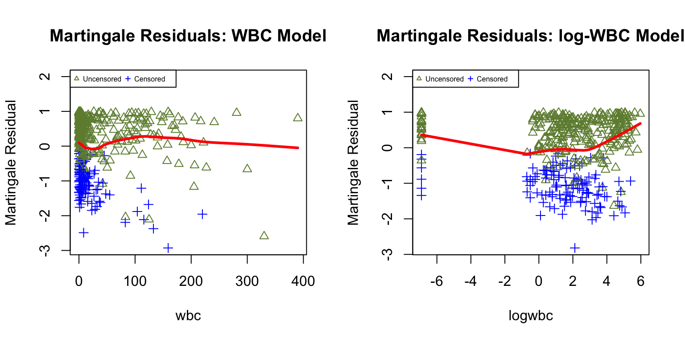
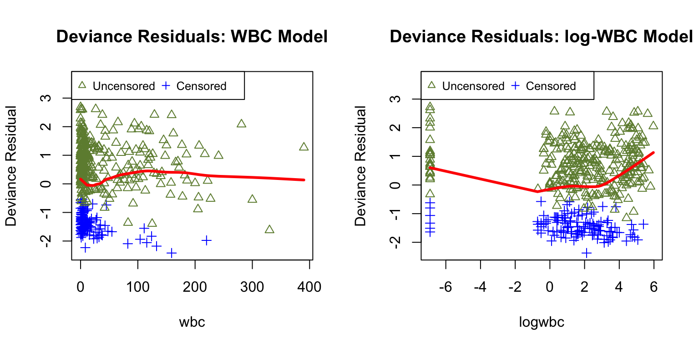

# Z-residual Diagnostics for CoxPH Shared Frailty Models

**Installing Zresidual and Required Packages**

Code

``` r

if (!requireNamespace("Zresidual", quietly = TRUE)) {
  if (!requireNamespace("remotes", quietly = TRUE)) install.packages("remotes")
  remotes::install_github("user/Zresidual", upgrade = "never", dependencies = TRUE)
}
```

Code

``` r

library(Zresidual)
```

Code

``` r

pkgs <- c(
  "survival", "EnvStats", "VGAM", "plotrix", "actuar", "stringr", "Rlab", "dplyr", "rlang", "tidyr",
  "matrixStats", "timeDate", "katex", "gt")

missing_pkgs <- pkgs[!vapply(pkgs, requireNamespace, logical(1), quietly = TRUE)]
if (length(missing_pkgs)) {
  message("Installing missing packages via renv: ", paste(missing_pkgs, collapse = ", "))
  renv::install(missing_pkgs)
}

invisible(lapply(pkgs, function(p) {
  suppressPackageStartupMessages(library(p, character.only = TRUE))
}))
```

## Introduction

This vignette explains how to use the `Zresidual` package to calculate
Z-residuals based on the output of the `coxph` function from the
`survival` package in R. It also demonstrates how Z-residuals can be
used to assess the overall goodness of fit (GOF) and identify specific
model misspecifications in semi-parametric shared frailty models. It is
a compannion to the paper by @Wu2025Zresidual

## Definition of Z-residual

We use Z-residuals to diagnose shared frailty models in a Cox
proportional hazards setting where the baseline function is unspecified.
For a group i with n_i individuals, let y\_{ij} be a possibly
right-censored observation and \delta\_{ij} be the indicator for being
uncensored. The normalized randomized survival probabilities (RSPs) are
defined as:

S\_{ij}^{R}(y\_{ij}, \delta\_{ij}, U\_{ij}) = \left\\ \begin{array}{rl}
S\_{ij}(y\_{ij}), & \text{if } \delta\_{ij}=1, \\
U\_{ij}\\S\_{ij}(y\_{ij}), & \text{if } \delta\_{ij}=0, \end{array}
\right. \tag{1}

where U\_{ij} \sim \text{Uniform}(0, 1) and S\_{ij}(\cdot) is the
postulated survival function. RSPs are transformed into Z-residuals via
the normal quantile function:

r\_{ij}^{Z}(y\_{ij}, \delta\_{ij}, U\_{ij})=-\Phi^{-1}
(S\_{ij}^R(y\_{ij}, \delta\_{ij}, U\_{ij})) \tag{2}

Under the true model, Z-residuals are normally distributed. This
transformation allows researchers to leverage traditional
normal-regression diagnostic tools for censored data. Furthermore,
normal transformation highlights extreme RSPs that may indicate model
misspecification but could otherwise be overlooked.

## Examples for Illustration and Demonstration

### Load the real Dataset

We utilize data from 411 acute myeloid leukemia patients recorded at the
M. D. Anderson Cancer Center (1980–1996). The dataset focuses on
patients under 60 from 24 districts. Key variables include survival
time, age, sex, white blood cell count (WBC), and the Townsend
deprivation score (TPI).

Code

``` r

data_path <- system.file("extdata", "LeukSurv.rda", package = "Zresidual")

load(data_path)

LeukSurv <- transform(LeukSurv,
  district = as.factor(district),
  sex      = as.factor(sex),
  logwbc   = log(wbc + 0.001)
)
LeukSurv <- LeukSurv[LeukSurv$age < 60, ]
```

### Fitting Models

We compare two models: the **wbc model** (using raw WBC) and the **lwbc
model** (using log-transformed WBC).

Code

``` r

fit_wbc <- coxph(Surv(time, cens) ~ age + sex + wbc + tpi +
          frailty(district, distribution="gamma"), data = LeukSurv)

fit_logwbc <- coxph(Surv(time, cens) ~ age + sex + logwbc + tpi +
          frailty(district, distribution="gamma"), data = LeukSurv)
```

### Computing Z-Residuals

Once the model is fitted, we calculate Z-residuals for both models using
50 repetitions. We pass `traindata = LeukSurv` to allow the internal
predictive functions to reconstruct the baseline hazard.

Code

``` r

zresid_wbc    <- Zresidual(fit = fit_wbc, data = LeukSurv, traindata = LeukSurv, nrep = 1000)
zresid_logwbc <- Zresidual(fit = fit_logwbc, data = LeukSurv, traindata = LeukSurv, nrep = 1000)
zcov_wbc      <- Zcov(fit_wbc, data = LeukSurv)
zcov_logwbc   <- Zcov(fit_logwbc, data = LeukSurv)
```

### Inspecting the Normality of Z-Residuals for Checking Overall GOF

Under a correctly specified shared frailty model, Z-residuals should be
approximately standard normal. The animation below shows the 50
randomization replicates for both candidate models.

GIF Generation Code (Folded)

``` r

gif_qq_path <- paste0(results_dir, "qqplot_anim.gif")

if (force_rerun || !file.exists(gif_qq_path)) {
  gifski::save_gif(
    expr = {
      for (i in 1:10) {
        par(mfrow = c(1, 2), mar = c(4, 4, 2, 2))
        qqnorm(zresid_wbc, irep = i)
        qqnorm(zresid_logwbc, irep = i)
      }
    },
    gif_file = gif_qq_path, width = 800, height = 400, res = 72, delay = 0.8
  )
}

knitr::include_graphics(gif_qq_path)
```


Figure 1: Z-residual Q–Q plots for overall GOF (animation over 50
randomization replicates). Left: WBC model; right: log-WBC model.

### Assessing Homogeneity of Grouped Z-Residuals

A key Z-residual diagnostic for model adequacy is **homogeneity**. After
sorting observations by the linear predictor (LP), grouped Z-residuals
should have similar mean and variance if the model is adequate.

GIF Generation Code (Folded)

``` r

gif_lp_path <- paste0(results_dir, "lp_anim.gif")

if (force_rerun || !file.exists(gif_lp_path)) {
  gifski::save_gif(
    expr = {
      for (i in 1:10) {
        par(mfrow = c(2, 2))
        plot(zresid_wbc, info = zcov_wbc, x_axis_var="lp", main.title = "Scatter: WBC Model", 
             irep=i, add_lowess = TRUE)
        plot(zresid_logwbc, info = zcov_logwbc, x_axis_var="lp", main.title = "Scatter: log-WBC Model",
             irep=i, add_lowess = TRUE)
        boxplot(zresid_wbc, info = zcov_wbc, x_axis_var = "lp", main.title = "Boxplot: WBC Model", irep=i)
        boxplot(zresid_logwbc, info = zcov_logwbc, x_axis_var = "lp", main.title = "Boxplot: log-WBC Model", irep=i)
      }
    },
    gif_file = gif_lp_path, width = 900, height = 900, res = 96, delay = 1
  )
}

knitr::include_graphics(gif_lp_path)
```


Figure 2: Homogeneity check by grouping Z-residuals over the linear
predictor (LP) (animation over 50 randomization replicates).

### Identifying Misspecification of Functional Form

To diagnose **functional-form misspecification**, we inspect Z-residuals
against a specific covariate. If the functional form is adequate, the
LOWESS curve should remain near 0.

GIF Generation Code (Folded)

``` r

gif_wbc_path <- paste0(results_dir, "wbc_anim.gif")

if (force_rerun || !file.exists(gif_wbc_path)) {
  gifski::save_gif(
    expr = {
      for (i in 1:10) {
        par(mfrow = c(2, 2), mar = c(4, 4, 1.5, 2))
        plot(zresid_wbc, info = zcov_wbc, x_axis_var = "wbc", main.title = "Scatter: WBC Model",
             irep=i, add_lowess = TRUE)
        plot(zresid_logwbc, info = zcov_logwbc, x_axis_var = "logwbc", main.title = "Scatter: log-WBC Model",        
             irep=i, add_lowess = TRUE)
        boxplot(zresid_wbc, info = zcov_wbc, x_axis_var = "wbc", main.title = "Boxplot: WBC Model", irep=i)
        boxplot(zresid_logwbc, info = zcov_logwbc, x_axis_var = "logwbc", main.title = "Boxplot: log-WBC Model", irep=i)
      }
    },
    gif_file = gif_wbc_path, width = 900, height = 900, res = 96, delay = 1
  )
}

knitr::include_graphics(gif_wbc_path)
```


Figure 3: Covariate-specific functional-form diagnostic (animation over
50 randomization replicates).

## Statistical Test Summaries

### Quantitative Evaluation of Homogeneity

Table 1 summarizes the first 10 randomization repetitions for both
candidate models.

[TABLE]

Table 1: Diagnostic p-values of 10 replicated Z-residuals.

### Histograms of Replicated P-values

Code

``` r

med_pval_sw_wbc      <- upper_bound_pvalue(p_rep = test_sw_wbc)
med_pval_sw_logwbc   <- upper_bound_pvalue(p_rep = test_sw_logwbc)
med_pval_sf_wbc      <- upper_bound_pvalue(p_rep = test_sf_wbc)
med_pval_sf_logwbc   <- upper_bound_pvalue(p_rep = test_sf_logwbc)

med_pval_aov_lp_wbc    <- upper_bound_pvalue(p_rep = aov_wbc_lp)
med_pval_aov_lp_logwbc <- upper_bound_pvalue(p_rep = aov_logwbc_lp)
med_pval_aov_wbc       <- upper_bound_pvalue(p_rep = aov_wbc)
med_pval_aov_logwbc    <- upper_bound_pvalue(p_rep = aov_logwbc)

par(mfrow = c(4, 2), mar = c(4, 4, 2, 2))
hist(test_sw_wbc, main = "Z-SW: WBC Model", breaks = 20)
abline(v = med_pval_sw_wbc, col = "red")

hist(test_sw_logwbc, main = "Z-SW: log-WBC Model", breaks = 20)
abline(v = med_pval_sw_logwbc, col = "red")

hist(test_sf_wbc, main = "Z-SF: WBC Model", breaks = 20)
abline(v = med_pval_sf_wbc, col = "red")

hist(test_sf_logwbc, main = "Z-SF: log-WBC Model", breaks = 20)
abline(v = med_pval_sf_logwbc, col = "red")

hist(aov_wbc_lp, main = "Z-AOV-LP: WBC Model", breaks = 20)
abline(v = med_pval_aov_lp_wbc, col = "red")

hist(aov_logwbc_lp, main = "Z-AOV-LP: log-WBC Model", breaks = 20)
abline(v = med_pval_aov_lp_logwbc, col = "red")

hist(aov_wbc, main = "Z-AOV-wbc: WBC Model", breaks = 20)
abline(v = med_pval_aov_wbc, col = "red")

hist(aov_logwbc, main = "Z-AOV-logwbc: log-WBC Model", breaks = 20)
abline(v = med_pval_aov_logwbc, col = "red")
```



Figure 4: Histograms of replicated Z-residual test p-values.

### Summary of Median Upper-Bound P-values

| Model         | AIC       | CZ-CSF | Z-SW  | Z-SF  | Z-AOV-LP | Z-AOV-log(wbc) |
|---------------|-----------|--------|-------|-------|----------|----------------|
| WBC model     | 3,111.669 | 0.550  | 0.478 | 0.722 | 1.000    | 1.000          |
| log-WBC model | 3,132.105 | 0.339  | 0.602 | 0.890 | 1.000    | 0.000          |

Table 2: LeukSurv model comparison and replicated-test summaries.

## Other Residual Analysis

### Censored Z-residuals

| Model      | CZ-CSF p-value |
|------------|----------------|
| wbc model  | 0.5496         |
| lwbc model | 0.3387         |

Table 3: CZ-CSF p-values for the wbc and lwbc models.

### Cox-Snell Residuals

Code

``` r

ucs_wbc    <- surv_residuals(fit_wbc, LeukSurv, "Cox-Snell")
ucs_logwbc <- surv_residuals(fit_logwbc, LeukSurv, "Cox-Snell")

par(mfrow = c(1, 2))
plot.cs.residual(ucs_wbc, main.title = "CS Residuals: WBC Model")
plot.cs.residual(ucs_logwbc, main.title = "CS Residuals: log-WBC Model")
```



Figure 5: Cumulative hazard plot of Cox–Snell (CS) residuals.

### Martingale Residuals

Code

``` r

martg_wbc    <- surv_residuals(fit_wbc, LeukSurv, "martingale")
martg_logwbc <- surv_residuals(fit_logwbc, LeukSurv, "martingale")

par(mfrow = c(1, 2))
plot.martg.resid(martg_wbc, x_axis_var="wbc", main.title = "Martingale Residuals: WBC Model")
plot.martg.resid(martg_logwbc, x_axis_var="logwbc", main.title = "Martingale Residuals: log-WBC Model")
```



Figure 6: Martingale residual plots against wbc and log(wbc).

### Deviance Residuals

Code

``` r

dev_wbc    <- surv_residuals(fit_wbc, LeukSurv, "deviance")
dev_logwbc <- surv_residuals(fit_logwbc, LeukSurv, "deviance")

par(mfrow = c(1, 2))
plot.dev.resid(dev_wbc, x_axis_var="wbc", main.title = "Deviance Residuals: WBC Model")
plot.dev.resid(dev_logwbc, x_axis_var="logwbc", main.title = "Deviance Residuals: log-WBC Model")
```



Figure 7: Deviance residual plots against wbc and log(wbc).
