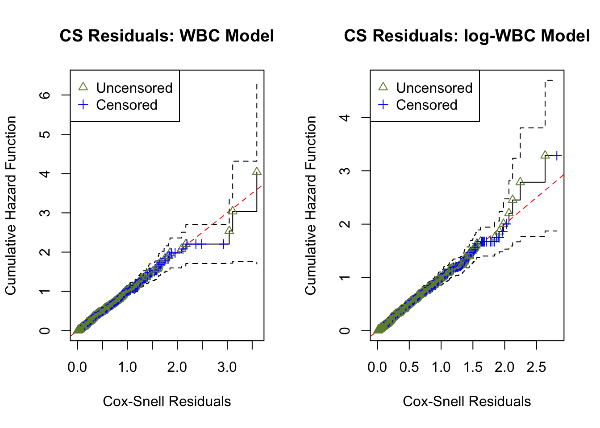

# Z-residual Diagnostic Tool for Assessing Covariate Functional Form in Shared Frailty Models

## 1 Installing Zresidual and Required Packages

### 1.1 Installing Z-residual from Source (Developer Use)

Code

``` r
# For developer use to refresh the local installation
remove.packages("Zresidual")
devtools::document()
devtools::install()
```

### 1.2 Installing Z-residual from GitHub

Code

``` r
if (!requireNamespace("Zresidual", quietly = TRUE)) {
  if (!requireNamespace("remotes", quietly = TRUE)) install.packages("remotes")
  remotes::install_github("tiw150/Zresidual", upgrade = "never", dependencies = TRUE)
}
```

Code

``` r
library(Zresidual)
```

### 1.3 Loading R Packages used in this Demo

Code

``` r
pkgs <- c(
  "survival", "EnvStats", "foreach", "statip", "VGAM", "plotrix", "actuar",
  "stringr", "Rlab", "dplyr", "rlang", "tidyr",
  "matrixStats", "timeDate", "katex", "gt", "loo"
)

missing_pkgs <- pkgs[!vapply(pkgs, requireNamespace, logical(1), quietly = TRUE)]
if (length(missing_pkgs)) {
  message("Installing missing packages: ", paste(missing_pkgs, collapse = ", "))
  install.packages(missing_pkgs, dependencies = TRUE)
}

invisible(lapply(pkgs, function(p) {
  suppressPackageStartupMessages(library(p, character.only = TRUE))
}))

nc <- parallel::detectCores(logical = FALSE)
if (!is.na(nc) && nc > 1) options(mc.cores = nc - 1)
```

## 2 Introduction

This vignette explains how to use the `Zresidual` package to calculate
Z-residuals based on the output of the `coxph` function from the
`survival` package in R. It also demonstrates how Z-residuals can be
used to assess the overall goodness of fit (GOF) and identify specific
model misspecifications in semi-parametric shared frailty models. For a
thorough understanding of the underlying theory, please refer to:
*“Z-residual diagnostics for detecting misspecification of the
functional form of covariates for shared frailty models.”*

## 3 Definition of Z-residual

We use Z-residuals to diagnose shared frailty models in a Cox
proportional hazards setting where the baseline function is unspecified.
For a group i with n_i individuals, let y\_{ij} be a possibly
right-censored observation and \delta\_{ij} be the indicator for being
uncensored. The normalized randomized survival probabilities (RSPs) are
defined as:

S\_{ij}^{R}(y\_{ij}, \delta\_{ij}, U\_{ij}) = \left\\ \begin{array}{rl}
S\_{ij}(y\_{ij}), & \text{if } \delta\_{ij}=1, \\
U\_{ij}\\S\_{ij}(y\_{ij}), & \text{if } \delta\_{ij}=0, \end{array}
\right. \tag{1}

where U\_{ij} \sim \text{Uniform}(0, 1) and S\_{ij}(\cdot) is the
postulated survival function. RSPs are transformed into Z-residuals via
the normal quantile function:

r\_{ij}^{Z}(y\_{ij}, \delta\_{ij}, U\_{ij})=-\Phi^{-1}
(S\_{ij}^R(y\_{ij}, \delta\_{ij}, U\_{ij})) \tag{2}

Under the true model, Z-residuals are normally distributed. This
transformation allows researchers to leverage traditional
normal-regression diagnostic tools for censored data. Furthermore,
normal transformation highlights extreme RSPs that may indicate model
misspecification but could otherwise be overlooked.

## 4 Examples for Illustration and Demonstration

### 4.1 Load the real Dataset

We utilize data from 411 acute myeloid leukemia patients recorded at the
M. D. Anderson Cancer Center (1980–1996). The dataset focuses on
patients under 60 from 24 districts. Key variables include survival
time, age, sex, white blood cell count (WBC), and the Townsend
deprivation score (TPI).

Code

``` r
data_path <- system.file("extdata", "LeukSurv.rda", package = "Zresidual")
load(data_path)

LeukSurv <- transform(LeukSurv,
  district = as.factor(district),
  sex      = as.factor(sex),
  logwbc   = log(wbc + 0.001)
)
LeukSurv <- LeukSurv[LeukSurv$age < 60, ]
```

### 4.2 Fitting Models

We compare two models: the **wbc model** (using raw WBC) and the **lwbc
model** (using log-transformed WBC).

Code

``` r
fit_LeukSurv_wbc <- coxph(Surv(time, cens) ~ age + sex + wbc + tpi +
          frailty(district, distribution="gamma"), data = LeukSurv)

fit_LeukSurv_logwbc <- coxph(Surv(time, cens) ~ age + sex + logwbc + tpi +
          frailty(district, distribution="gamma"), data = LeukSurv)
```

### 4.3 Computing Z-Residuals

Once the model is fitted, we calculate Z-residuals for both models using
1,000 repetitions to account for randomization in censored cases.

Code

``` r
Zresid.LeukSurv.wbc <- Zresidual(object = fit_LeukSurv_wbc, nrep = 1000)
Zresid.LeukSurv.logwbc <- Zresidual(object = fit_LeukSurv_logwbc, nrep = 1000)
```

### 4.4 Inspecting the Normality of Z-Residuals for Checking Overall GOF

Under a correctly specified shared frailty model, Z-residuals should be
approximately standard normal, so a Q–Q plot should closely follow the
45° reference line. Because Z-residuals are generated from randomized
survival probabilities for censored observations, the realized
Z-residual set (and any normality-test p-value) can vary from one
randomization replicate to another.

To assess overall goodness-of-fit (GOF), we primarily use Q–Q plots, and
we report the replicate-specific Shapiro–Wilk (Z-SW) normality-test
p-value as a compact numerical summary. The animation below shows the
first 10 randomization replicates for both candidate models.

GIF Generation Code (Folded)

``` r
gif_qq_name <- "qqplot_anim.gif"
gif_qq_path <- file.path(extdata_path, gif_qq_name)

if (is_dev && (force_rerun || !file.exists(gif_qq_path))) {
  gifski::save_gif(
    expr = {
      for (i in 1:10) {
        par(mfrow = c(1, 2), mar = c(4, 4, 2, 2))
        qqnorm.zresid(Zresid.LeukSurv.wbc, irep = i)
        qqnorm.zresid(Zresid.LeukSurv.logwbc, irep = i)
      }
    },
    gif_file = gif_qq_path, width = 800, height = 400, res = 72, delay = 0.8
  )
}

local_qq <- get_local_asset(gif_qq_name, extdata_path, local_assets_dir)
if (!is.null(local_qq)) {
  knitr::include_graphics(local_qq)
} else {
  par(mfrow = c(1, 2))
  qqnorm.zresid(Zresid.LeukSurv.wbc, irep = 1)
  qqnorm.zresid(Zresid.LeukSurv.logwbc, irep = 1)
}
```


Figure 1: Z-residual Q–Q plots for overall GOF (animation over 10
randomization replicates). Left: WBC model; right: log-WBC model. Each
frame corresponds to one regenerated Z-residual set; the panel title
reports the replicate-specific Z-SW p-value.

Across frames, both models show QQ patterns close to the diagonal with
no obvious tail inflation. In this LeukSurv example, the overall GOF
check alone does not distinguish the two competing functional forms (raw
WBC vs log-WBC); the more targeted covariate-specific diagnostics in
Sections 4.5–4.6 are needed.

### 4.5 Assessing Homogeneity of Grouped Z-Residuals

A key Z-residual diagnostic for model adequacy is **homogeneity**: after
sorting observations by the linear predictor (LP) and splitting into (k)
groups, the grouped Z-residuals should have (approximately) the same
mean and variance across LP groups if the model is adequate.
Graphically, we expect: - the LOWESS smooth in the Z-residual
scatterplot vs LP to stay close to the horizontal line at 0, and - the
grouped boxplots to show similar centers and spreads.

We report two replicate-specific p-values to summarize the LP-group
homogeneity checks. **Z-AOV-LP** is the ANOVA F-test p-value for
equality of the *group means*, and **Z-BL-LP** is the Bartlett’s test
p-value for equality of the *group variances*. In the LeukSurv example,
across randomization replicates both the WBC and log-WBC models
typically produce relatively large Z-AOV-LP and Z-BL-LP p-values,
consistent with the visual impression that the LOWESS smooth stays near
0 and the grouped boxplots have comparable centers and spreads. Overall,
LP-based grouping does not provide strong evidence of lack of fit for
either model in this dataset.

GIF Generation Code (Folded)

``` r
gif_lp_name <- "lp_anim.gif"
gif_lp_path <- file.path(extdata_path, gif_lp_name)

if (is_dev && (force_rerun || !file.exists(gif_lp_path))) {
  gifski::save_gif(
    expr = {
      for (i in 1:10) {
        par(mfrow = c(2, 2))
        plot(Zresid.LeukSurv.wbc, x_axis_var="lp", main.title = "Scatter: WBC Model", 
             irep=i,add_lowess = TRUE)
        plot(Zresid.LeukSurv.logwbc, x_axis_var="lp", main.title = "Scatter: log-WBC Model",
             irep=i,add_lowess = TRUE)
        boxplot(Zresid.LeukSurv.wbc, x_axis_var = "lp", main.title = "Boxplot: WBC Model", irep=i)
        boxplot(Zresid.LeukSurv.logwbc, x_axis_var = "lp", main.title = "Boxplot: log-WBC Model", irep=i)
      }
    },
    gif_file = gif_lp_path, width = 900, height = 900, res = 96, delay = 1
  )
}

local_lp <- get_local_asset(gif_lp_name, extdata_path, local_assets_dir)
if (!is.null(local_lp)) knitr::include_graphics(local_lp)
```


Figure 2: Homogeneity check by grouping Z-residuals over the linear
predictor (LP) (animation over 10 randomization replicates). Top row:
scatterplots with LOWESS smooth; bottom row: grouped boxplots. Each
frame reports replicate-specific Z-AOV-LP (ANOVA for equal means) and
Z-BL-LP (Bartlett’s test for equal variances) p-values.

In this dataset, the LP-based homogeneity diagnostic does not clearly
separate the two candidate models. We therefore proceed to
covariate-specific diagnostics to assess whether the functional form of
the WBC effect is misspecified.

### 4.6 Identifying Misspecification of Functional Form

To diagnose **functional-form misspecification** for a specific
covariate, we inspect Z-residuals against that covariate (or its
transformed version) and test whether grouped residual means differ
across covariate intervals. If the functional form is adequate, the
LOWESS curve should remain near 0 and grouped boxplots should have
similar centers.

Here we directly compare the WBC model plotted against **wbc**, and the
log-WBC (lwbc) model plotted against **logwbc**.

In the LeukSurv data, when diagnosing the functional form against
log(wbc), the log-WBC model typically shows a pronounced systematic
(non-linear) pattern in the LOWESS smooth and clear differences in
grouped means, leading to consistently small **Z-AOV-log(wbc)** p-values
across randomization replicates (e.g., \< 0.01 in the real-data
analysis). By contrast, the WBC model does not show comparably strong
evidence of misspecification in this view: its replicated Z-AOV p-values
are generally much larger, in line with a flatter smooth around zero and
more homogeneous grouped boxplots. This contrast remains stable across
many randomization replicates (see Sections 5.2–5.3).

GIF Generation Code (Folded)

``` r
gif_wbc_name <- "wbc_anim.gif"
gif_wbc_path <- file.path(extdata_path, gif_wbc_name)

if (is_dev && (force_rerun || !file.exists(gif_wbc_path))) {
  gifski::save_gif(
    expr = {
      for (i in 1:10) {
        par(mfrow = c(2, 2), mar = c(4, 4, 1.5, 2))
        plot(Zresid.LeukSurv.wbc, x_axis_var = "wbc", main.title = "Scatter: WBC Model",
        irep=i,add_lowess = TRUE)
        plot(Zresid.LeukSurv.logwbc, x_axis_var = "logwbc", main.title = "Scatter: log-WBC Model",          irep=i,add_lowess = TRUE)
        boxplot(Zresid.LeukSurv.wbc, x_axis_var = "wbc", main.title = "Boxplot: WBC Model", irep=i)
        boxplot(Zresid.LeukSurv.logwbc, x_axis_var = "logwbc", main.title = "Boxplot: log-WBC Model", irep=i)
      }
    },
    gif_file = gif_wbc_path, width = 900, height = 900, res = 96, delay = 1
  )
}

local_wbc <- get_local_asset(gif_wbc_name, extdata_path, local_assets_dir)
if (!is.null(local_wbc)) knitr::include_graphics(local_wbc)
```


Figure 3: Covariate-specific functional-form diagnostic (animation over
10 randomization replicates). Left column (WBC model): Z-residuals vs
wbc; right column (log-WBC model): Z-residuals vs logwbc. Top row:
scatterplots with LOWESS smooth; bottom row: grouped boxplots with
replicate-specific Z-AOV (covariate) p-values reported in the titles.

## 5 Statistical Test Summaries

### 5.1 Quantitative Evaluation of Homogeneity

To quantify the homogeneity of grouped Z-residuals, we test whether the
grouped residuals are “homogeneously distributed” by examining equality
of group means using an ANOVA F-test (Z-AOV). In addition, we report
Z-BL p-values from Bartlett’s test as a complementary check for equality
of variances across the same groups.

Table 1 summarizes the first 10 randomization repetitions. In these
repetitions, the LP-grouping diagnostics (Z-AOV-LP and Z-BL-LP) yield
predominantly non-small p-values for both models, consistent with no
strong evidence of non-homogeneity against the linear predictor. In
contrast, the covariate-grouping test for the log-WBC specification
(aov.lwbc) is consistently near zero, indicating strong group-mean
differences across log(wbc) intervals.

| Summary of Residual Homogeneity Tests |  |  |  |  |  |  |  |
|----|----|----|----|----|----|----|----|
| aov.wbc.lp | aov.lwbc.lp | bl.wbc.lp | bl.lwbc.lp | aov.wbc | aov.lwbc | bl.wbc | bl.lwbc |
| 0.8701 | 0.7299 | 0.5704 | 0.0612 | 0.5868 | 0.0001 | 0.9885 | 0.2790 |
| 0.8412 | 0.9480 | 0.6401 | 0.1581 | 0.6530 | 0.0000 | 0.9172 | 0.2637 |
| 0.9724 | 0.7668 | 0.6459 | 0.7844 | 0.5199 | 0.0000 | 0.7273 | 0.5765 |
| 0.7362 | 0.8222 | 0.3540 | 0.8142 | 0.6979 | 0.0000 | 0.5464 | 0.6532 |
| 0.9054 | 0.6409 | 0.8773 | 0.2562 | 0.6199 | 0.0000 | 0.9712 | 0.1497 |
| 0.9276 | 0.7744 | 0.9451 | 0.7756 | 0.8013 | 0.0000 | 0.2140 | 0.5403 |
| 0.9730 | 0.8900 | 0.1287 | 0.1508 | 0.5196 | 0.0001 | 0.4639 | 0.9744 |
| 0.9149 | 0.8252 | 0.9055 | 0.3982 | 0.5772 | 0.0001 | 0.9324 | 0.6336 |
| 0.8917 | 0.5897 | 0.8742 | 0.1209 | 0.5520 | 0.0000 | 0.7991 | 0.9185 |
| 0.9076 | 0.6479 | 0.7593 | 0.2998 | 0.6597 | 0.0000 | 0.9469 | 0.7640 |

Table 1: Summary of residual homogeneity tests for the first 10
randomization repetitions. Z-AOV are ANOVA F-test p-values for equality
of grouped Z-residual means; Z-BL are Bartlett’s test p-values for
equality of variances. Suffix “.lp” indicates grouping by the linear
predictor; columns without “.lp” indicate grouping by the covariate
scale used in the diagnostic.

### 5.2 Summary of Minimum P-values (p\_{min})

To connect the above visuals to the replicated-test summary used in the
paper, the following compact table reproduces the LeukSurv comparison
(AIC, CZ-CSF p-value, and p\_{min} summaries over 1000 replicates).
Notably, the log-WBC model fails the Z-AOV-log(wbc) diagnostic
decisively, even though some overall-fit diagnostics (e.g., CZ-CSF and
normality-based tests) do not flag this inadequacy.

| Model | AIC | CZ-CSF (p-value) | Z-SW (p_min) | Z-SF (p_min) | Z-AOV-LP (p_min) | Z-AOV-log(wbc) (p_min) |
|----|----|----|----|----|----|----|
| WBC model | 3,111.669 | 0.255 | 0.495 | 0.693 | 0.703 | 0.074 |
| log-WBC model | 3,132.105 | 0.305 | 0.579 | 0.781 | 0.978 | \<1e-5 |
| \$p\_{min}\$ is a conservative upper-bound summary for replicated p-values; a practical failure cutoff can be much larger than 0.05 (e.g., 0.25). |  |  |  |  |  |  |

Table 2: LeukSurv model comparison and replicated-test summaries (AIC,
CZ-CSF p-value, and p\_{min} across 1000 randomization replicates).

### 5.3 Histograms of Replicated P-values

These histograms reveal that the Z-SW, Z-SF, and Z-AOV-LP tests for both
models have a substantial proportion of p-values greater than 0.05,
leading to large pmin values. In contrast, the replicated Z-AOV-log(wbc)
p-values for the lwbc model are nearly all smaller than 0.001, providing
strong evidence that the log transformation of wbc is inappropriate for
modelling the survival time.

Code

``` r
pmin.sw.wbc<-pvalue.min(pv=sw.wbc); pmin.sw.lwbc<-pvalue.min(pv=sw.lwbc)
pmin.sf.wbc<-pvalue.min(pv=sf.wbc); pmin.sf.lwbc<-pvalue.min(pv=sf.lwbc)
pmin.aov.lp.wbc<-pvalue.min(pv=aov.wbc.lp); pmin.aov.lp.lwbc<-pvalue.min(pv=aov.lwbc.lp)
pmin.aov.wbc<-pvalue.min(pv=aov.wbc); pmin.aov.lwbc<-pvalue.min(pv=aov.lwbc)

par(mfrow = c(4, 2), mar = c(4, 4, 2, 2))
hist(sw.wbc, main = "Z-SW: WBC Model", breaks = 20); abline(v = pmin.sw.wbc, col = "red")
hist(sw.lwbc, main = "Z-SW: log-WBC Model", breaks = 20); abline(v = pmin.sw.lwbc, col = "red")
hist(sf.wbc, main = "Z-SF: WBC Model", breaks = 20); abline(v = pmin.sf.wbc, col = "red")
hist(sf.lwbc, main = "Z-SF: log-WBC Model", breaks = 20); abline(v = pmin.sf.lwbc, col = "red")
hist(aov.wbc.lp, main = "Z-AOV (LP): WBC Model", breaks = 20); abline(v = pmin.aov.lp.wbc, col = "red")
hist(aov.lwbc.lp, main = "Z-AOV (LP): log-WBC Model", breaks = 20); abline(v = pmin.aov.lp.lwbc, col = "red")
hist(aov.wbc, main = "Z-AOV (WBC): WBC Model", breaks = 20); abline(v = pmin.aov.wbc, col = "red")
hist(aov.lwbc, main = "Z-AOV (log-WBC): log-WBC Model", breaks = 20); abline(v = pmin.aov.lwbc, col = "red")
```


Figure 4: Histograms of 1000 replicated Z-residual test p-values for the
wbc model (left panels) and the lwbc model (right panels). The vertical
red lines indicate pmin for the 1000 replicated p-values. Note that the
upper limit of the x-axis for Z-AOV-log(wbc) p-values for the lwbc model
is 0.005, and 1 for others.

## 6 Other Residual Analysis

### 6.1 Censored Z-residuals

We first report the **CZ-CSF** p-values, where “censored Z-residuals”
are defined by r^{n}\_{ij}(t\_{ij}) =
-\Phi^{-1}\\\left(\widehat{S}\_{ij}(t\_{ij})\right), and normality is
assessed using the SF test for multiply censored data
(EnvStats::gofTestCensored).

As an overall goodness-of-fit check, CZ-CSF evaluates the residual
distribution but does not assess specific model assumptions such as the
functional form of covariates.

| Model      | CZ-CSF p-value |
|------------|----------------|
| wbc model  | 0.5702         |
| lwbc model | 0.0754         |

Table 3: CZ-CSF p-values (SF normality test for censored Z-residuals)
for the wbc and lwbc models.

### 6.2 Cox-Snell Residuals

The Cox–Snell residual is defined as r^{CS}\_{ij}(t\_{ij}) =
-\log\\\left(\widehat{S}\_{ij}(t\_{ij})\right).

Overall GOF checks based on CS residuals are commonly used, but they may
not provide sufficient information about specific model inadequacies
(e.g., the functional form of a covariate).

Code

``` r
ucs.wbc <- surv_residuals(fit.object = fit_LeukSurv_wbc, data= LeukSurv, residual.type = "Cox-Snell" )
ucs.lwbc <- surv_residuals(fit.object = fit_LeukSurv_logwbc, data= LeukSurv, residual.type = "Cox-Snell" )
par(mfrow = c(1, 2)); plot.cs.residual(ucs.wbc, main.title = "CS Residuals: WBC Model"); plot.cs.residual(ucs.lwbc, main.title = "CS Residuals: log-WBC Model")
```



Figure 5: Cumulative hazard plot of Cox–Snell (CS) residuals for the wbc
and lwbc models. With censoring, the Kaplan–Meier estimate of the
survivor function of CS residuals is compared against the 45° straight
line as an overall diagnostic.

### 6.3 Martingale Residuals

To gain further insights, residual scatterplots are often augmented with
LOWESS lines; however, the visual interpretation can still be
subjective, and numerical tests are difficult to derive because these
residuals lack a reference distribution under censoring.

Code

``` r
martg.wbc <- surv_residuals(fit.object = fit_LeukSurv_wbc, data= LeukSurv, residual.type = "martingale")
martg.lwbc <- surv_residuals(fit.object = fit_LeukSurv_logwbc, data= LeukSurv, residual.type = "martingale")
par(mfrow = c(1, 2))
plot.martg.resid(martg.wbc, x_axis_var="wbc", main.title = "Martingale Residuals: WBC Model")
plot.martg.resid(martg.lwbc, x_axis_var="logwbc", main.title = "Martingale Residuals: log-WBC Model")
```


Figure 6: Martingale residual plots against wbc and log(wbc) for the wbc
and lwbc models, with a LOWESS smooth. Martingale residuals are commonly
used for visually assessing covariate functional form, but they are
asymmetric and lack a lower bound; moreover, deriving numerical tests is
challenging due to censoring and the lack of a reference distribution.

### 6.4 Deviance Residuals

Although deviance residuals reduce skewness relative to martingale
residuals and can improve visual assessment, objective numerical
measures remain hard to construct under censoring because these
residuals do not admit a convenient reference distribution.

Code

``` r
dev.wbc <- surv_residuals(fit.object = fit_LeukSurv_wbc, data= LeukSurv, residual.type = "deviance")
dev.lwbc <- surv_residuals(fit.object = fit_LeukSurv_logwbc, data= LeukSurv, residual.type = "deviance")
par(mfrow = c(1, 2))
plot.dev.resid(dev.wbc, x_axis_var="wbc", main.title = "Deviance Residuals: WBC Model")
plot.dev.resid(dev.lwbc, x_axis_var="logwbc", main.title = "Deviance Residuals: log-WBC Model")
```


Figure 7: Deviance residual plots against wbc and log(wbc) for the wbc
and lwbc models, with a LOWESS smooth. Deviance residuals are a
normalized transformation of martingale residuals that aim to achieve
symmetry; when the fitted model is appropriate, they have mean zero and
are approximately symmetrically distributed around zero.

## 7 References

Wu, T., Li, L., & Feng, C. (2024). Z-residual diagnostic tool for
assessing covariate functional form in shared frailty models. *Journal
of Applied Statistics*, 52(1), 28–58.
<https://doi.org/10.1080/02664763.2024.2355551>
