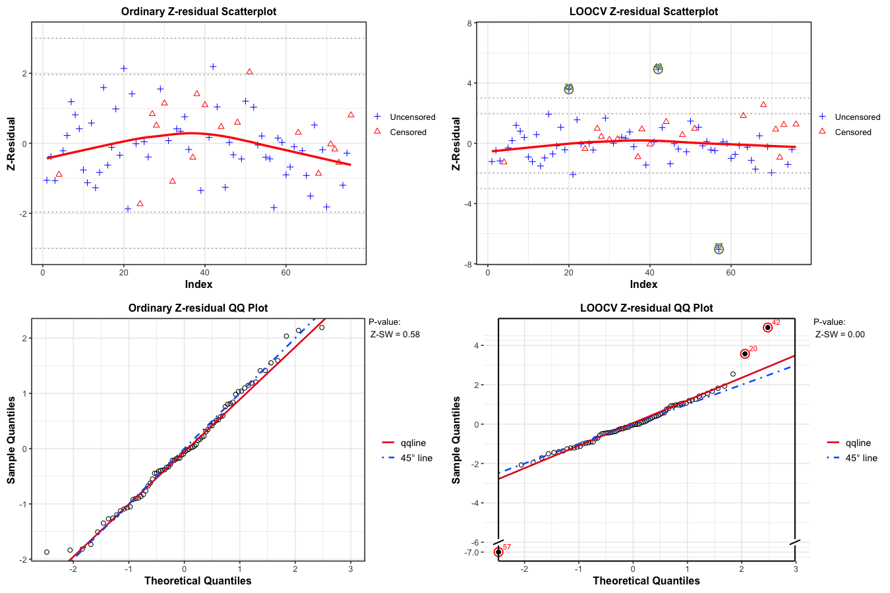
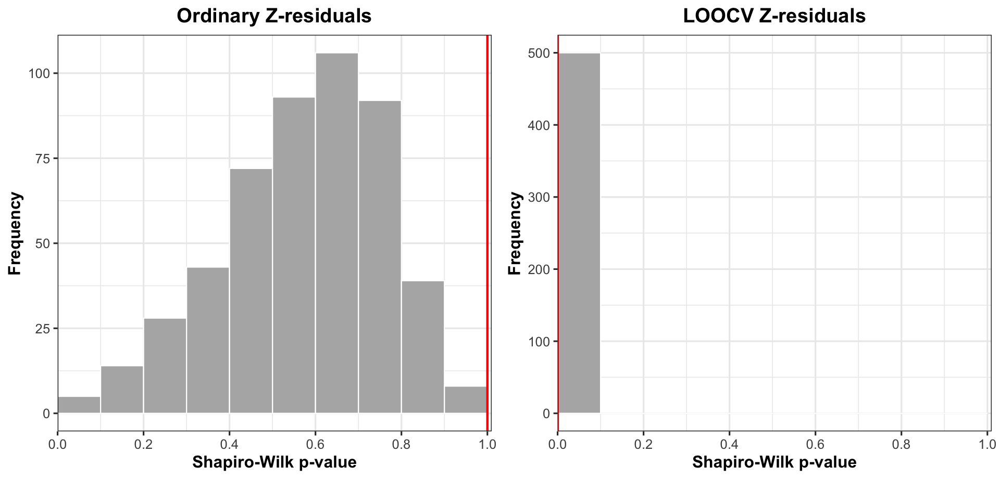

# Cross-validatory Z-Residual for Diagnosing Shared Frailty Models

**Installing Zresidual and Required Packages**

Code

``` r
if (!requireNamespace("Zresidual", quietly = TRUE)) {
  if (!requireNamespace("remotes", quietly = TRUE)) install.packages("remotes")
  remotes::install_github("tiw150/Zresidual", upgrade = "never", dependencies = TRUE)
}
```

Code

``` r
library(Zresidual)
pkgs <- c(
  "survival", "EnvStats", "VGAM", "plotrix", "actuar", "stringr", "Rlab", "dplyr", "rlang", "tidyr",
  "matrixStats", "timeDate", "katex", "gt")

missing_pkgs <- pkgs[!vapply(pkgs, requireNamespace, logical(1), quietly = TRUE)]
if (length(missing_pkgs)) {
  message("Installing missing packages via renv: ", paste(missing_pkgs, collapse = ", "))
  renv::install(missing_pkgs)
}

invisible(lapply(pkgs, function(p) {
  suppressPackageStartupMessages(library(p, character.only = TRUE))
}))
```

    Warning: package 'Rlab' was built under R version 4.5.2

    Warning: package 'dplyr' was built under R version 4.5.2

    Warning: package 'rlang' was built under R version 4.5.2

    Warning: package 'tidyr' was built under R version 4.5.2

## Introduction

This vignette explains how to use the `Zresidual` package to calculate
cross-validatory (CV) Z-residuals based on the output of the coxph
function from the survival package in R. It also serves as a
demonstration of how to use cross-validatory Z-residuals to identify
outliers in semi-parametric shared frailty models. To fully understand
the detailed definitions and the example data analysis results, please
refer to the original paper titled “Cross-validatory Z-Residual for
Diagnosing Shared Frailty Models”.

## Definition of Cross-validatory Z-residual

We use Z-residual to diagnose shared frailty models in a Cox
proportional hazard setting with a baseline function unspecified.
Suppose there are g groups of individuals, with each group containing
n_i individuals, indexed as i = 1, 2, , g in the case of clustered
failure survival data. Let y\_{ij} be a possibly right-censored
observation for the jth individual from the ith group, and \delta\_{ij}
be the indicator for being uncensored. The normalized randomized
survival probabilities (RSPs) for y\_{ij} in the shared frailty model is
defined as:

S\_{ij}^{R}(y\_{ij}, \delta\_{ij}, U\_{ij}) = \left\\ \begin{array}{rl}
S\_{ij}(y\_{ij}), & \text{if \$y\_{ij}\$ is uncensored, i.e.,
\$\delta\_{ij}=1\$,}\\ U\_{ij}\\S\_{ij}(y\_{ij}), & \text{if \$y\_{ij}\$
is censored, i.e., \$\delta\_{ij}=0\$,} \end{array} \right. \tag{1}

where U\_{ij} is a uniform random number on (0, 1), and S\_{ij}(\cdot)
is the postulated survival function for t\_{ij} given x\_{ij}.
S\_{ij}^{R}(y\_{ij}, \delta\_{ij}, U\_{ij}) is a random number between 0
and S\_{ij}(y\_{ij}) when y\_{ij} is censored. It is proved that the
RSPs are uniformly distributed on (0,1) given x\_{i} under the true
model. Therefore, the RSPs can be transformed into residuals with any
desired distribution. We prefer to transform them with the normal
quantile: r\_{ij}^{Z}(y\_{ij}, \delta\_{ij}, U\_{ij})=-\Phi^{-1}
(S\_{ij}^R(y\_{ij}, \delta\_{ij}, U\_{ij})), \tag{2} which is normally
distributed under the true model, so that we can conduct model
diagnostics with Z-residuals for censored data in the same way as
conducting model diagnostics for a normal regression model. There are a
few advantages of transforming RSPs into Z-residuals. First, the
diagnostics methods for checking normal regression are rich in the
literature. Second, transforming RSPs into normal deviates facilitates
the identification of extremely small and large RSPs. The frequency of
such small RSPs may be too small to be highlighted by the plots of RSPs.
However, the presence of such extreme SPs, even very few, is indicative
of model misspecification. Normal transformation can highlight such
extreme RSPs.

In our study, we employ both leave-one-out cross-validation (LOOCV) and
10-fold cross-validation (10-fold CV) techniques to compute
cross-validatory Z-residuals. In LOOCV Z-residual, one observation,
t\_{ij}^{test}, is excluded from the dataset with n observations. The
remaining observations, acting as the training dataset, are used for
parameter estimation in the shared frailty model. Fitting the model to
the training dataset produces the estimated regression coefficients,
\hat{\beta'}, and frailty effects, \hat{z_i}. The Breslow estimator
helps estimate the cumulative baseline hazard (\hat{H_0}). The survival
function \hat{S}\_{ij}(y\_{ij}) for the test observation y\_{ij}^{test}
is computed using: \hat{S}\_{ij}(y\_{ij}^{test}) = \exp \\- \hat{z_i}
\exp(\hat{\beta'} x\_{ij}) \hat{H}\_0(y\_{ij}^{test}) \\. Subsequently,
the RSP for the observed t\_{ij} is defined as:
\hat{S}\_{ij}^{R}(t\_{ij}^{test}, d\_{ij}, U\_{ij})= \left\\
\begin{array}{rl} \hat{S}\_{ij}(t\_{ij}^{test}), & \text{if
\$t\_{ij}^{test}\$ is uncensored, i.e., \$d\_{ij}=1\$,}\\
U\_{ij}\\\hat{S}\_{ij}(t\_{ij}^{test}), & \text{if \$t\_{ij}^{test}\$ is
censored, i.e., \$d\_{ij}=0\$.} \end{array} \right. \tag{3}

Resulting in the Z-residual for t\_{ij}^{test}:
\hat{z}\_{ij}(t\_{ij}^{test}, d\_{ij}, U\_{ij})=-\Phi^{-1}
(\hat{S}\_{ij}^R(t\_{ij}^{test}, d\_{ij}, U\_{ij})). \tag{4} By
repeating these steps for each observation (n times), a LOOCV predictive
Z-residual is calculated for each observation.

For cluster-based or categorical covariate values, specific
considerations are employed during the LOOCV and k-fold CV methods.
Clusters with only one observation cannot be included in the training
dataset, and similar requirements are imposed on categorical covariates.
As such, cross-validatory Z-residuals for these observations are
designated as NA in the implementation.

## Examples for Illustration and Demonstration

### Load the real Dataset

This example demonstrates the practical application of cross-validatory
Z-residuals in identifying outliers within a study on kidney infections.
The dataset comprises records from 38 kidney patients using a portable
dialysis machine. It documents the times of the first and second
recurrences of kidney infections for these patients. Each patient’s
survival time is defined as the duration until infection from catheter
insertion. The patient records are considered as clusters due to shared
frailty, signifying the common effect across patients. Instances where
the catheter is removed for reasons other than infection are treated as
censored observations, accounting for 24% of the dataset. The dataset
encompasses 38 patient clusters, with each patient having exactly two
observations, resulting in a total sample size of 76. This dataset is
frequently employed to exemplify shared frailty models.

Code

``` r
kidney <- survival::kidney

kidney <- as.data.frame(kidney)
kidney <- stats::na.omit(kidney)
kidney$disease <- as.factor(kidney$disease)
```

Code

``` r
knitr::kable(
  data.frame(
    n_observations = nrow(kidney),
    n_subjects = length(unique(kidney$id)),
    n_events = sum(kidney$status == 1),
    n_censored = sum(kidney$status == 0)
  ),
  caption = "Summary of the kidney infection dataset."
)
```

| n_observations | n_subjects | n_events | n_censored |
|---------------:|-----------:|---------:|-----------:|
|             76 |         38 |       58 |         18 |

Summary of the kidney infection dataset.

### Fitting Models

We fit a shared gamma frailty model with three covariates: covariates:
age in years, gender (male or female), and four disease types (0=GN,
1=AN, 2=PKD, 3=Other).

Code

``` r
fit_kidney <- survival::coxph(
  survival::Surv(time, status) ~ age + sex + disease +
    frailty(id, distribution = "gamma"),
  data = kidney
)
```

### Z-residual and LOOCV Z-residual calculation

We computed Z-residuals using the No-CV and LOOCV methods for the kidney
infection dataset. Given the similarity in performance between the
10-fold CV and LOOCV Z-residual methods demonstrated in the simulation
studies and the manageable computational load, we focused on the LOOCV
method.

Code

``` r
nrep_demo <- 500

nrep_demo <- 500L

Zresid.kidney <- Zresidual(
  fit = fit_kidney,
  data = kidney,
  nrep = nrep_demo
)

Zresid.kidney.info <- attr(
  Zresid.kidney,
  "zcov"
)

CVZresid.kidney <- Zresidual_CV(
  object = fit_kidney,
  data = kidney,
  nrep = nrep_demo,
  nfolds = nrow(kidney),
  seed = 123
)
```

    Warning in coxpenal.fit(X, Y, istrat, offset, init = init, control, weights =
    weights, : Inner loop failed to coverge for iterations 2

Code

``` r
CVZresid.kidney.info <- attr(
  CVZresid.kidney,
  "zcov"
)
```

### Inspecting the Normality of Z-Residuals for Checking Overall GOF

The first and second columns of Figure 1 display scatterplots against
the index and QQ plots of the Z-residuals calculated with the No-CV and
LOOCV methods. The No-CV Z-residuals predominantly fall within the range
of -3 to 3, displaying alignment with the 45^\circ straight line in the
QQ plot. The QQ plot of the No-CV Z-residuals indicates a SW p-value of
around 0.70, signifying a well-fitted model to the dataset. Thus, the
diagnostic results using No-CV Z-residuals suggest the suitability of
the shared frailty model for the dataset without identifying any
outliers. However, analysis of the scatterplot of LOOCV Z-residuals
reveals that the Z-residuals of cases labeled 20 and 42 exceed 3. These
instances are considered outliers for the shared frailty model. The QQ
plot of LOOCV Z-residuals displays a noticeable deviation from the
45^\circ straight line, attributed to the considerable Z-residuals of
the two identified outliers. The SW p-value of LOOCV Z-residuals is
notably small, measuring less than 0.01, as evident in the QQ plot. In
summary, the diagnosis results with LOOCV Z-residuals suggest that the
fitted shared frailty model is inadequate for this dataset, and two
cases exhibit excessive Z-residuals, categorized as outliers for this
model.

Animated ggplot diagnostic panels (folded)

``` r
kidney_combined_path <- file.path(
  resources_path,
  "kidney_combined_ggplot_anim.gif"
)

# Both plotting methods print their ggplot objects as a side effect. Build each
# animation frame on a null device so that only the final 2 x 2 arrangement is
# written to the GIF device.
build_kidney_diagnostic_frame <- function(irep) {
  grDevices::pdf(file = NULL)
  on.exit(grDevices::dev.off(), add = TRUE)

  common_theme <- ggplot2::theme_bw(base_size = 12) +
    ggplot2::theme(
      plot.margin = ggplot2::margin(6, 8, 6, 8),
      plot.title = ggplot2::element_text(size = 12, hjust = 0.5)
    )

  ordinary_scatter <- plot(
    Zresid.kidney,
    zcov = Zresid.kidney.info,
    x_axis_var = "index",
    main.title = "Ordinary Z-residual Scatterplot",
    outlier.return = TRUE,
    irep = irep,
    add_lowess = TRUE,
    theme = common_theme
  )

  loocv_scatter <- plot(
    CVZresid.kidney,
    zcov = CVZresid.kidney.info,
    x_axis_var = "index",
    main.title = "LOOCV Z-residual Scatterplot",
    outlier.return = TRUE,
    irep = irep,
    add_lowess = TRUE,
    theme = common_theme
  )

  ordinary_qq_result <- qqnorm(
    Zresid.kidney,
    zcov = Zresid.kidney.info,
    main.title = "Ordinary Z-residual QQ Plot",
    irep = irep,
    theme = common_theme
  )

  loocv_qq_result <- qqnorm(
    CVZresid.kidney,
    zcov = CVZresid.kidney.info,
    main.title = "LOOCV Z-residual QQ Plot",
    irep = irep,
    theme = common_theme
  )

  list(
    ordinary_scatter,
    loocv_scatter,
    ordinary_qq_result$plots[[1L]],
    loocv_qq_result$plots[[1L]]
  )
}

n_animation_frames <- min(
  10L,
  ncol(Zresid.kidney),
  ncol(CVZresid.kidney)
)

if (force_rerun || !file.exists(kidney_combined_path)) {
  diagnostic_frames <- lapply(
    seq_len(n_animation_frames),
    build_kidney_diagnostic_frame
  )

  gifski::save_gif(
    expr = {
      for (frame_plots in diagnostic_frames) {
        gridExtra::grid.arrange(
          grobs = frame_plots,
          ncol = 2,
          nrow = 2
        )
      }
    },
    gif_file = kidney_combined_path,
    width = 1350,
    height = 900,
    delay = 1,
    res = 96
  )
}

knitr::include_graphics(kidney_combined_path)
```



Figure 1: Scatterplots and QQ plots of ordinary and leave-one-out
cross-validated Z-residuals for the shared frailty Cox model.

### Diagnostic Tests with Z-residuals

The Shapiro-Wilk (SW) or Shapiro-Francia (SF) normality tests applied to
Z-residuals can be used to numerically test the overall GOF of the
model.

Code

``` r
sw.kidney <- sw.test.zresid(Zresid.kidney)
sw.kidney.cv <- sw.test.zresid(CVZresid.kidney)

sf.kidney <- sf_test.zresid(Zresid.kidney)
sf.kidney.cv <- sf_test.zresid(CVZresid.kidney)

statistic_tests <- data.frame(
  sw.kidney, sf.kidney,
  sw.kidney.cv, sf.kidney.cv
)


statistic_tests %>%
  head(10) %>%
  gt() %>%
  tab_header(title = "Summary of Residual Tests") %>%
  tab_spanner(
    label = "No CV Model",
    columns = c(sw.kidney, sf.kidney)
  ) %>%
  tab_spanner(
    label = "LOOCV Model",
    columns = c(sw.kidney.cv, sf.kidney.cv)
  ) %>%
  cols_label(
    sw.kidney    = "Z-SW",
    sf.kidney     = "Z-SF",
    sw.kidney.cv       = "CV_Z-SW",
    sf.kidney.cv        = "CV_Z-SW"
  ) %>%
  fmt_number(columns = everything(), decimals = 4)
```

[TABLE]

There exists randomness in the Z-residuals of censored observations,
meaning that different sets of Z-residuals can be generated for the same
dataset using distinct random numbers. Thus, to test the robustness of
the previously conducted diagnosis, we replicated a large number of
realizations of Z-residuals. The Figure 2 exhibits histograms of 1000 SW
test p-values, each derived from a set of No-CV or LOOCV Z-residuals.
More than 95% of the SW p-values for No-CV Z-residuals surpass 0.05,
whereas 100% of the SW p-values for LOOCV Z-residuals fall below 0.05.
This consistency across numerous replications confirms that the
evaluation of the misspecification of the shared frailty model is not
incidental to a specific set of LOOCV Z-residuals but a recurring
conclusion supported by extensive Z-residual replications.

| method              | p_value_upper_bound |
|:--------------------|--------------------:|
| Ordinary Z-residual |                   1 |
| LOOCV Z-residual    |                   0 |

Upper-bound Shapiro-Wilk p-values for ordinary and LOOCV Z-residuals.

Code

``` r
histogram_theme <- ggplot2::theme_bw(base_size = 12) +
  ggplot2::theme(
    plot.title = ggplot2::element_text(face = "bold", hjust = 0.5),
    axis.title = ggplot2::element_text(face = "bold")
  )

make_sw_histogram <- function(values, upper_bound, title) {
  plot_data <- data.frame(p_value = as.numeric(values))

  ggplot2::ggplot(
    plot_data,
    ggplot2::aes(x = .data$p_value)
  ) +
    ggplot2::geom_histogram(
      breaks = seq(0, 1, by = 0.1),
      fill = "grey70",
      colour = "white",
      linewidth = 0.4,
      closed = "left"
    ) +
    ggplot2::geom_vline(
      xintercept = upper_bound,
      colour = "red",
      linewidth = 0.8
    ) +
    ggplot2::scale_x_continuous(
      breaks = seq(0, 1, by = 0.2),
      limits = c(0, 1),
      expand = ggplot2::expansion(mult = c(0, 0.01))
    ) +
    ggplot2::labs(
      title = title,
      x = "Shapiro-Wilk p-value",
      y = "Frequency"
    ) +
    histogram_theme
}

ordinary_sw_histogram <- make_sw_histogram(
  sw.kidney,
  med_pval_sw_nocv,
  "Ordinary Z-residuals"
)

loocv_sw_histogram <- make_sw_histogram(
  sw.kidney.cv,
  med_pval_sw_loocv,
  "LOOCV Z-residuals"
)

gridExtra::grid.arrange(
  ordinary_sw_histogram,
  loocv_sw_histogram,
  ncol = 2
)
```



Sampling distributions of Shapiro-Wilk p-values across randomized
Z-residual replicates.

## References

Wu, T., Feng, C., & Li, L. (2024). Cross-Validatory Z-Residual for
Diagnosing Shared Frailty Models. The American Statistician, 79(2),
198–211. https://doi.org/10.1080/00031305.2024.2421370
