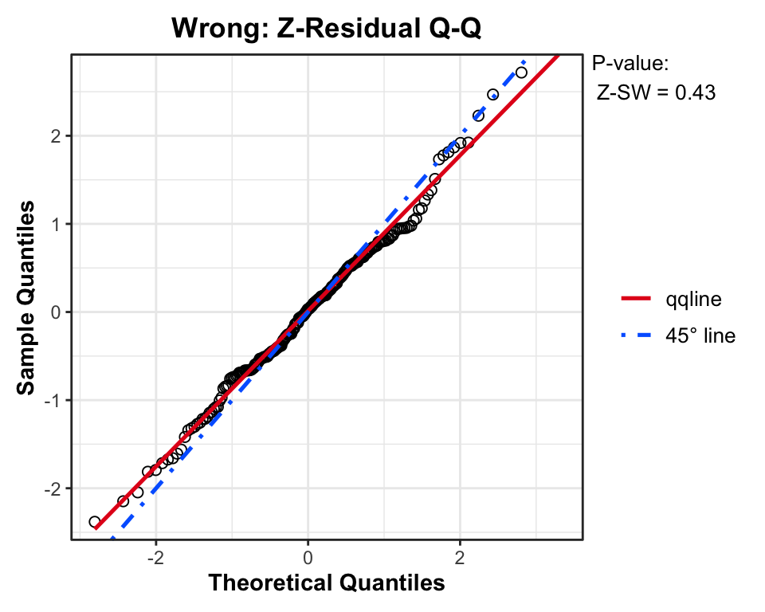
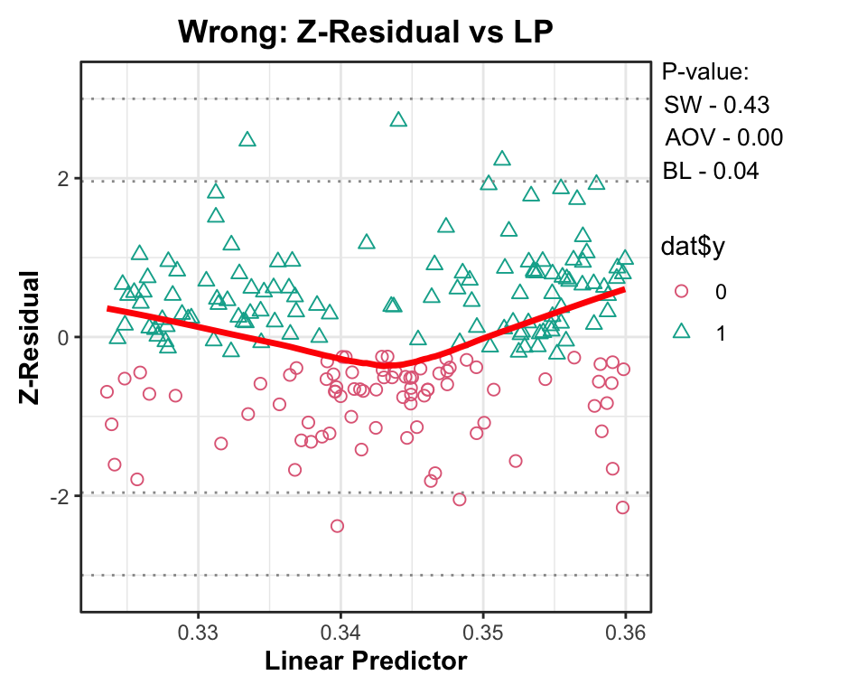
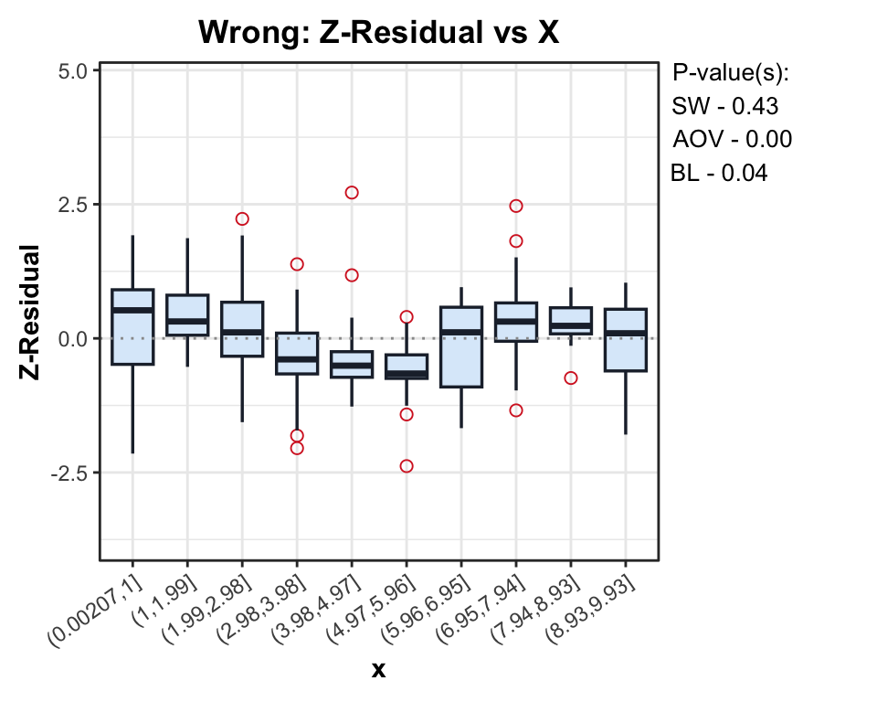
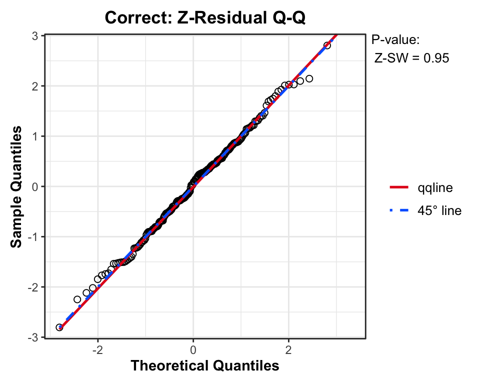
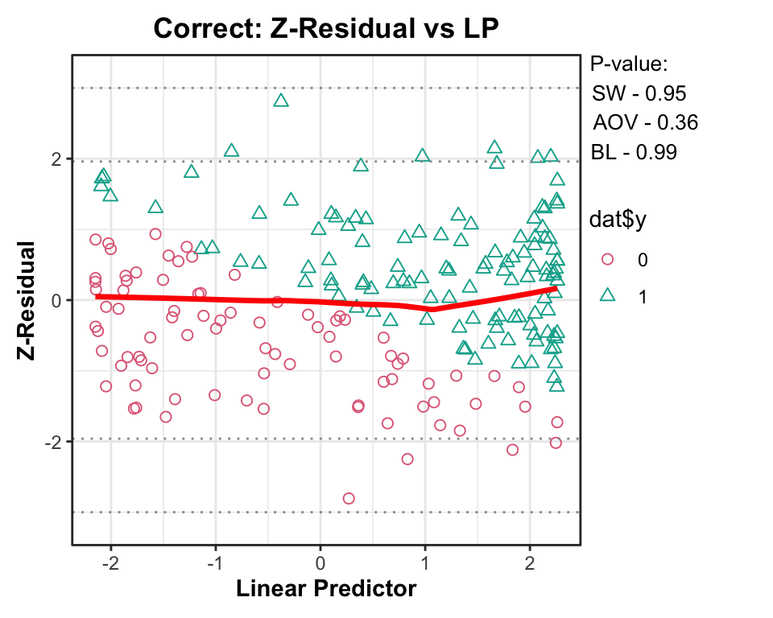
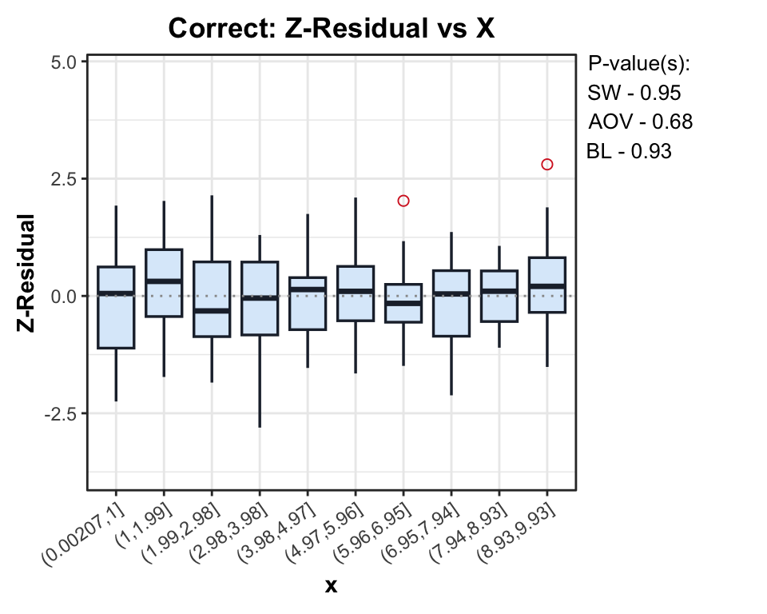
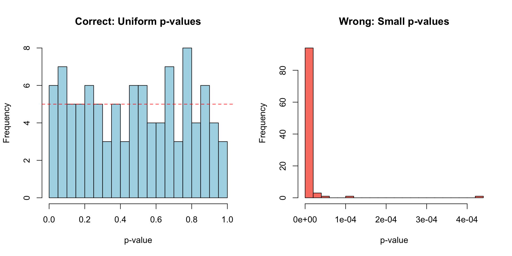

# Z-residual Diagnostics for `glm` Logistic Regression

Code

``` r
library(Zresidual)
```

## 1. Simulating a Non-linear Dataset

Because `Zresidual` provides native support for models fitted via the
base R [`glm()`](https://rdrr.io/r/stats/glm.html) function, we do not
need to construct a custom predictive function. We can jump straight
into simulating our dataset.

We simulate a dataset where the true log-odds follow a sine wave. With x
\in \[0, 10\], the average log-odds are near zero, naturally keeping
prevalence \approx 0.5.

Code

``` r
n <- 200

x <- runif(n, 0, 10)
# True non-linear relationship (sine wave)
eta_true <- 2.5 * sin(x) 
y <- rbinom(n, 1, plogis(eta_true))

dat <- data.frame(y = y, x = x)

cat("Prevalence (proportion of 1s):", mean(dat$y), "\n")
```

    Prevalence (proportion of 1s): 0.585 

## 2. Fitting Models and Calculating Z-residuals

We compare a **Wrong Model** (assuming a linear relationship) against a
**Correct Model** (specifying the sine term).

Code

``` r
# 1. Wrong Model (Linear)
fit_wrong <- glm(y ~ x, family = binomial(), data = dat)

# 2. Correct Model (Non-linear)
fit_correct <- glm(y ~ sin(x), family = binomial(), data = dat)

# Calculate Z-residuals using the built-in predictive backend (10 replicates each). 
# Covariates (zcov) are computed internally.
z_wrong   <- Zresidual(fit_wrong, data = dat, randomized = TRUE, nrep = 10)
z_correct <- Zresidual(fit_correct, data = dat, randomized = TRUE, nrep = 10)
```

## 3. Diagnostics with Z-residuals

The plots below display the diagnostics for a single set of Z-residuals.

Code

``` r
# Change this value from 1 to 10 to inspect another
# randomized residual replicate.
i <- 1

# ------------------------------------------------------------
# Row 1: misspecified linear model
# ------------------------------------------------------------

qqnorm(
  z_wrong,
  irep = i,
  main.title = "Wrong: Z-Residual Q-Q"
)
plot(
  z_wrong,
  x_axis_var = "lp",
  category = dat$y,
  irep = i,
  add_lowess = TRUE,
  main.title = "Wrong: Z-Residual vs LP"
)
boxplot(
  z_wrong,
  x_axis_var = "x",
  num.bin = 10,
  irep = i,
  main.title = "Wrong: Z-Residual vs X"
)
# ------------------------------------------------------------
# Row 2: correctly specified nonlinear model
# ------------------------------------------------------------

qqnorm(
  z_correct,
  irep = i,
  main.title = "Correct: Z-Residual Q-Q"
)
plot(
  z_correct,
  x_axis_var = "lp",
  category = dat$y,
  irep = i,
  add_lowess = TRUE,
  main.title = "Correct: Z-Residual vs LP"
)
boxplot(
  z_correct,
  x_axis_var = "x",
  num.bin = 10,
  irep = i,
  main.title = "Correct: Z-Residual vs X"
)
```













> **Note:** To inspect different realizations of the randomized
> residuals, change the value of `i` (the `irep` index) in the code
> chunk above.

**Replicated p-values of the same fitted models**

Code

``` r
res_table <- data.frame(
  Replicate = paste("Rep", seq_len(ncol(z_wrong))),
  Wrong_SW = as.numeric(
    sw.test.zresid(z_wrong)
  ),
  Wrong_AOV = as.numeric(
    aov.test.zresid(z_wrong, X = "x")
  ),
  Wrong_Bartlett = as.numeric(
    bartlett.test.zresid(z_wrong, X = "x")
  ),
  Correct_SW = as.numeric(
    sw.test.zresid(z_correct)
  ),
  Correct_AOV = as.numeric(
    aov.test.zresid(z_correct, X = "x")
  ),
  Correct_Bartlett = as.numeric(
    bartlett.test.zresid(z_correct, X = "x")
  )
)

knitr::kable(
  res_table,
  digits = 4,
  col.names = c(
    "Replicate",
    "Wrong: SW",
    "Wrong: AOV",
    "Wrong: Bartlett",
    "Correct: SW",
    "Correct: AOV",
    "Correct: Bartlett"
  ),
  caption = "Diagnostic test p-values across randomized replicates",
  align = "lcccccc"
)
```

| Replicate | Wrong: SW | Wrong: AOV | Wrong: Bartlett | Correct: SW | Correct: AOV | Correct: Bartlett |
|:---|:--:|:--:|:--:|:--:|:--:|:--:|
| Rep 1 | 0.4311 | 1e-04 | 0.0362 | 0.9523 | 0.6801 | 0.9284 |
| Rep 2 | 0.1417 | 0e+00 | 0.1499 | 0.1716 | 0.3364 | 0.8800 |
| Rep 3 | 0.2391 | 0e+00 | 0.6289 | 0.0774 | 0.1593 | 0.0736 |
| Rep 4 | 0.3432 | 0e+00 | 0.3988 | 0.9138 | 0.4456 | 0.7182 |
| Rep 5 | 0.6999 | 0e+00 | 0.0286 | 0.2488 | 0.6372 | 0.0643 |
| Rep 6 | 0.9705 | 0e+00 | 0.0435 | 0.6980 | 0.7856 | 0.5844 |
| Rep 7 | 0.2113 | 0e+00 | 0.3807 | 0.6245 | 0.9743 | 0.5433 |
| Rep 8 | 0.9602 | 1e-04 | 0.0991 | 0.3087 | 0.9737 | 0.1598 |
| Rep 9 | 0.1799 | 0e+00 | 0.1184 | 0.7733 | 0.0656 | 0.0108 |
| Rep 10 | 0.6822 | 1e-04 | 0.0495 | 0.4092 | 0.1808 | 0.8050 |

Diagnostic test p-values across randomized replicates

## 4. Sampling Distribution of AOV Nonlinearity Tests

We run a simulation loop to verify that the built-in implementation
correctly handles the binomial data and produces appropriate p-values.

Code

``` r
n_sim <- 100
sim_file <- paste0(file_prefix, "simulation_results.rds")

if (!force_rerun && file.exists(sim_file)) {
  sim_res <- readRDS(sim_file)
  p_c <- sim_res$p_c
  p_w <- sim_res$p_w
} else {
  p_c <- numeric(n_sim)
  p_w <- numeric(n_sim)
  n_sample <- 200 

  for(i in 1:n_sim) {
    x_sim <- runif(n_sample, 0, 10)
    
    # Generate true non-linear data
    eta_sim <- 2.5 * sin(x_sim)
    y_sim   <- rbinom(n_sample, 1, plogis(eta_sim))
    dat_sim <- data.frame(y = y_sim, x = x_sim)
    
    # --- Case 1: Wrong Model (Linear) ---
    fit_w <- glm(y ~ x, family = binomial(), data = dat_sim)
    z_w   <- Zresidual(fit_w, data = dat_sim, randomized = TRUE, nrep = 1)
    p_w[i] <- as.numeric(aov.test.zresid(z_w, X = "x"))
    
    # --- Case 2: Correct Model (Sine) ---
    fit_c <- glm(y ~ sin(x), family = binomial(), data = dat_sim)
    z_c   <- Zresidual(fit_c, data = dat_sim, randomized = TRUE, nrep = 1)
    p_c[i] <- as.numeric(aov.test.zresid(z_c, X = "x"))
  }
  
  saveRDS(list(p_c = p_c, p_w = p_w), sim_file)
}
```

Code

``` r
par(mfrow = c(1, 2))
hist(p_c, main = "Correct: Uniform p-values", xlab = "p-value", col = "lightblue", breaks = 20)
abline(h = n_sim / 20, col = "red", lty = 2)

hist(p_w, main = "Wrong: Small p-values", xlab = "p-value", col = "salmon", breaks = 20)
```



**Discussion:** For the **Correct Model**, the distribution of p-values
is uniform, indicating a well-specified model. For the **Wrong Model**,
most p-values are small (clustered near 0), indicating that the ANOVA
test successfully detected the non-linear trend.
