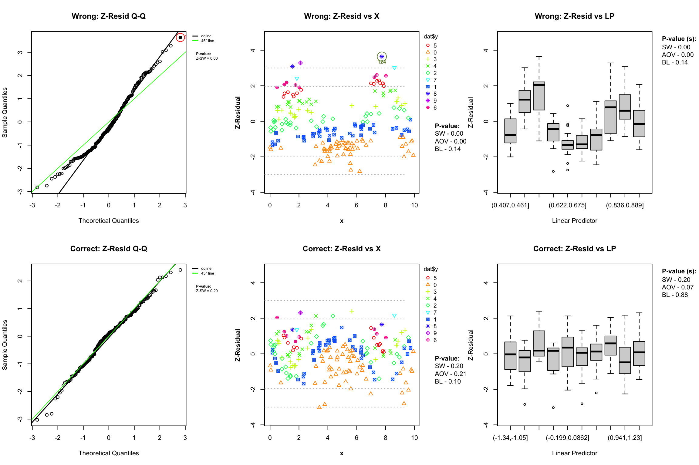
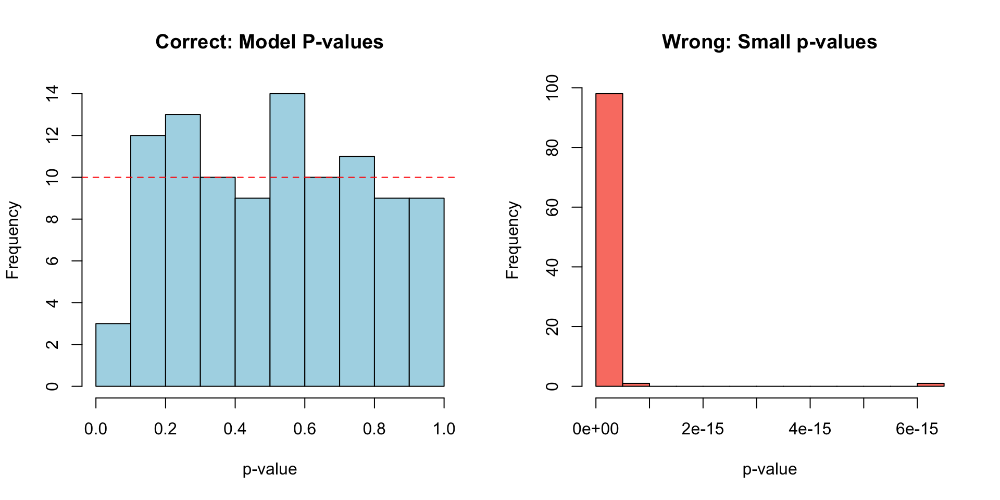

# Z-residual Diagnostics for `glm` Poisson Regression

## 1 Preparation: Data Loading and Caching

To rigorously evaluate our methodology and ensure direct comparability
with the `brms` demonstration, we utilize the exact same 100 independent
count datasets where the true log-rate follows a non-linear sine wave
over a continuous variable `x`.

Because standard frequentist [`glm()`](https://rdrr.io/r/stats/glm.html)
fits are computationally instantaneous, we do not need to cache the
fitted model objects to the hard drive. We will simply load the cached
datasets from `resources/brms_poission_models/` and fit the models on
the fly.

Code

``` r

if (!dir.exists(model_dir)) {
  dir.create(model_dir, recursive = TRUE)
}
set.seed(2026) ## for reproducing the same datasets
n_sim <- 100
n_sample <- 200 
sim_data <- vector("list", n_sim)

# Loop through iterations, checking for existing data files
for(i in 1:n_sim) {
  data_file <- paste0(model_dir, "/data_sim_", i, ".rds")
  
  if (!force_refit && file.exists(data_file)) {
    # If data exists from the brms run, read it
    sim_data[[i]] <- readRDS(data_file)
  } else {
    # Otherwise, simulate and save it
    x <- runif(n_sample, 0, 10)
    y <- rpois(n_sample, exp(1.5 * sin(x)))
    
    dat_i <- data.frame(y = y, x = x)
    sim_data[[i]] <- dat_i
    saveRDS(dat_i, file = data_file)
  }
}
```

## 2 Z-residual Using a Custom User-Defined `log_pointpred` Function

Since `Zresidual` is highly extensible, it can easily handle standard
frequentist models like `glm`. A frequentist model can be viewed as a
“Bayesian” model with a posterior consisting of exactly 1 draw (the
point estimate).

Below, we define a custom analytic function `log_pointpred_glm_poisson`
that extracts the predicted rates (\lambda) using the standard
[`predict()`](https://rdrr.io/r/stats/predict.html) function and
structures them into the 1 \times N matrix format expected by
`Zresidual`.

### 2.1 Define a Custom Predictive Function

Code

``` r

log_pointpred_glm_poisson <- function(fit, data = NULL, ...) {
  
  # 1. Resolve data
  data_in <- if (is.null(data)) model.frame(fit) else data
  
  # 2. Extract observed response
  # For glm objects, the response variable name can be extracted from the formula
  resp_var <- all.vars(formula(fit))[1]
  y_obs <- as.numeric(data_in[[resp_var]])
  n <- length(y_obs)
  
  # 3. Extract Point Estimate Expected Values (lambda)
  # type = "response" gives the predicted rate (lambda) on the outcome scale
  lambda <- predict(fit, newdata = data_in, type = "response")
  
  # 4. Calculate Log-PMF and Log-Survival Functions
  # We format these as 1 x N matrices because there is only 1 "draw"
  lpmf <- matrix(NA_real_, nrow = 1, ncol = n)
  lsf  <- matrix(NA_real_, nrow = 1, ncol = n)
  
  for (i in seq_len(n)) {
    lpmf[1, i] <- dpois(y_obs[i], lambda = lambda[i], log = TRUE)
    lsf[1, i]  <- ppois(y_obs[i], lambda = lambda[i], lower.tail = FALSE, log.p = TRUE)
  }
  
  list(
    log_like = lpmf,
    log_surv  = lsf,
    is_discrete = rep(1L, n)
  )
}
```

### 2.2 Single Dataset Evaluation

We retrieve our first cached dataset and evaluate the `glm` fits using
our custom function.

Code

``` r

# Retrieve the first dataset from disk
dat <- readRDS(paste0(model_dir, "/data_sim_1.rds"))

# Fit frequentist glm models
fit_wrong <- glm(y ~ x, family = poisson(), data = dat)
fit_correct <- glm(y ~ sin(x), family = poisson(), data = dat)

set.seed(123)

# Calculate Z-residuals explicitly passing the custom function
# Note: For M=1, mcmc_summarize method does not matter mathematically, but we leave it as "post"
z_wrong   <- Zresidual(fit_wrong, data = dat, randomized = TRUE, nrep = 10, log_pointpred = log_pointpred_glm_poisson)
z_correct <- Zresidual(fit_correct, data = dat, randomized = TRUE, nrep = 10, log_pointpred = log_pointpred_glm_poisson)
```

### 2.3 Diagnostics with Z-residuals

Code

``` r

i <- 1 # Change this value (1 to 10) to see other randomized replicates

par(mfrow = c(2, 3), mar = c(4, 4, 3, 1))

# --- ROW 1: WRONG MODEL (Linear) ---
qqnorm(z_wrong, irep = i, main = "Wrong: Z-Resid Q-Q")
```

    Outlier Indices : 124

Code

``` r

plot(z_wrong, x_axis_var = "x", category = dat$y, irep = i, main = "Wrong: Z-Resid vs X")
```

    Outlier Indices : 124

Code

``` r

boxplot(z_wrong, x_axis_var = "lp", irep = i, main = "Wrong: Z-Resid vs LP")

# --- ROW 2: CORRECT MODEL (Explicit Non-linear) ---
qqnorm(z_correct, irep = i, main = "Correct: Z-Resid Q-Q")
plot(z_correct, x_axis_var = "x", category = dat$y, irep = i, main = "Correct: Z-Resid vs X")
boxplot(z_correct, x_axis_var = "lp", irep = i, main = "Correct: Z-Resid vs LP")
```



**Replicated p-values of the same fitted models**

Code

``` r

res_table <- data.frame(
  "Replicate" = paste("Rep", 1:ncol(z_wrong)),
  "SW_W"      = as.numeric(sw.test.zresid(z_wrong)),
  "AOV_W"     = as.numeric(aov.test.zresid(z_wrong, X = "lp")),
  "BL_W"      = as.numeric(bartlett.test.zresid(z_wrong, X = "lp")),
  "SW_C"      = as.numeric(sw.test.zresid(z_correct)),
  "AOV_C"     = as.numeric(aov.test.zresid(z_correct, X = "lp")),
  "BL_C"      = as.numeric(bartlett.test.zresid(z_correct, X = "lp"))
)

res_table %>%
  kable(
    digits = 4, 
    col.names = c("Replicate", "SW", "AOV", "Bartlett", "SW", "AOV", "Bartlett"),
    caption = "Diagnostic Test p-values Across Randomized Replicates",
    align = "lcccccc"
  ) %>%
  kable_styling(
    bootstrap_options = c("striped", "condensed"), 
    full_width = FALSE,
    position = "center"
  ) %>%
  add_header_above(c(" " = 1, "Wrong Model (Linear)" = 3, "Correct Model (Non-linear)" = 3))
```

[TABLE]

Diagnostic Test p-values Across Randomized Replicates {.table .table
.table-striped .table-condensed .caption-top
style="width: auto !important; margin-left: auto; margin-right: auto;"}

### 2.4 Power Analysis via Sampling Distribution

We utilize the identical cached datasets to verify that our custom `glm`
implementation correctly detects misspecifications across all 100
simulations.

Code

``` r

glm_res_file <- "resources/glm_poisson_pvalues.rds"

if (!force_recalcz && file.exists(glm_res_file)) {
  res <- readRDS(glm_res_file)
  p_c <- res$p_c
  p_w <- res$p_w
} else {
  p_c <- numeric(n_sim)
  p_w <- numeric(n_sim)
  
  for(i in 1:n_sim) {
    # Load the matching dataset from disk
    dat_sim <- readRDS(paste0(model_dir, "/data_sim_", i, ".rds"))
    
    # --- Case 1: Wrong Model (Fit on the fly) ---
    fit_w_sim <- glm(y ~ x, family = poisson(), data = dat_sim)
    
    z_w_sim <- Zresidual(
      fit_w_sim, data = dat_sim, randomized = TRUE, 
      nrep = 1, log_pointpred = log_pointpred_glm_poisson
    )
    p_w[i] <- as.numeric(aov.test.zresid(z_w_sim, X = "lp"))
    
    # --- Case 2: Correct Model (Fit on the fly) ---
    fit_c_sim <- glm(y ~ sin(x), family = poisson(), data = dat_sim)
    
    z_c_sim <- Zresidual(
      fit_c_sim, data = dat_sim, randomized = TRUE, 
      nrep = 1, log_pointpred = log_pointpred_glm_poisson
    )
    p_c[i] <- as.numeric(aov.test.zresid(z_c_sim, X = "lp"))
  }
  
  saveRDS(list(p_c = p_c, p_w = p_w), glm_res_file)
}
```

Code

``` r

par(mfrow = c(1, 2))
hist(p_c, main = "Correct: Model P-values", xlab = "p-value", col = "lightblue", breaks = 10)
abline(h = n_sim / 10, col = "red", lty = 2)

hist(p_w, main = "Wrong: Small p-values", xlab = "p-value", col = "salmon", breaks = 10)
```


**Discussion:** The uniform distribution of p-values for the correctly
specified `glm` model confirms that `Zresidual` perfectly handles
standard frequentist output when provided a 1 \times N matrix via a
custom predictive function. Conversely, the strongly skewed distribution
for the linear specification demonstrates that the test reliably catches
structural misspecifications, mirroring the results we saw in the
Bayesian `brms` framework.

## 3 Z-residual Using Built-in Prediction Functions

Because `Zresidual` natively supports
[`stats::glm`](https://rdrr.io/r/stats/glm.html) objects, we do not need
to manually define a custom predictive function. The package
automatically detects the `glm` class and the `poisson` family, and
seamlessly routes the evaluation to its internal, optimized analytic
prediction functions.

A frequentist model is evaluated similarly to a “Bayesian” model with a
posterior consisting of exactly 1 draw (the point estimate).

### 3.1 Single Dataset Evaluation

We retrieve our first cached dataset and evaluate the `glm` fits. Notice
that we no longer pass a `log_pointpred` argument, letting `Zresidual`
handle the covariate extraction and prediction internally.

Code

``` r

# Retrieve the first dataset from disk
dat <- readRDS(paste0(model_dir, "/data_sim_1.rds"))

# Fit frequentist glm models
fit_wrong <- glm(y ~ x, family = poisson(), data = dat)
fit_correct <- glm(y ~ sin(x), family = poisson(), data = dat)

set.seed(123)

# Calculate Z-residuals using the built-in prediction method
# Note: For M=1, mcmc_summarize method does not matter mathematically.
z_wrong   <- Zresidual(fit_wrong, data = dat, randomized = TRUE, nrep = 10)
z_correct <- Zresidual(fit_correct, data = dat, randomized = TRUE, nrep = 10)
```

### 3.2 Diagnostics with Z-residuals

Code

``` r

i <- 1 # Change this value (1 to 10) to see other randomized replicates

par(mfrow = c(2, 3), mar = c(4, 4, 3, 1))

# --- ROW 1: WRONG MODEL (Linear) ---
qqnorm(z_wrong, irep = i, main = "Wrong: Z-Resid Q-Q")
```

    Outlier Indices : 124

Code

``` r

plot(z_wrong, x_axis_var = "x", category = dat$y, irep = i, main = "Wrong: Z-Resid vs X")
```

    Outlier Indices : 124

Code

``` r

boxplot(z_wrong, x_axis_var = "lp", irep = i, main = "Wrong: Z-Resid vs LP")

# --- ROW 2: CORRECT MODEL (Explicit Non-linear) ---
qqnorm(z_correct, irep = i, main = "Correct: Z-Resid Q-Q")
plot(z_correct, x_axis_var = "x", category = dat$y, irep = i, main = "Correct: Z-Resid vs X")
boxplot(z_correct, x_axis_var = "lp", irep = i, main = "Correct: Z-Resid vs LP")
```


**Replicated p-values of the same fitted models**

Code

``` r

res_table <- data.frame(
  "Replicate" = paste("Rep", 1:ncol(z_wrong)),
  "SW_W"      = as.numeric(sw.test.zresid(z_wrong)),
  "AOV_W"     = as.numeric(aov.test.zresid(z_wrong, X = "lp")),
  "BL_W"      = as.numeric(bartlett.test.zresid(z_wrong, X = "lp")),
  "SW_C"      = as.numeric(sw.test.zresid(z_correct)),
  "AOV_C"     = as.numeric(aov.test.zresid(z_correct, X = "lp")),
  "BL_C"      = as.numeric(bartlett.test.zresid(z_correct, X = "lp"))
)

res_table %>%
  kable(
    digits = 4, 
    col.names = c("Replicate", "SW", "AOV", "Bartlett", "SW", "AOV", "Bartlett"),
    caption = "Diagnostic Test p-values Across Randomized Replicates",
    align = "lcccccc"
  ) %>%
  kable_styling(
    bootstrap_options = c("striped", "condensed"), 
    full_width = FALSE,
    position = "center"
  ) %>%
  add_header_above(c(" " = 1, "Wrong Model (Linear)" = 3, "Correct Model (Non-linear)" = 3))
```

[TABLE]

Diagnostic Test p-values Across Randomized Replicates {.table .table
.table-striped .table-condensed .caption-top
style="width: auto !important; margin-left: auto; margin-right: auto;"}

### 3.3 Power Analysis via Sampling Distribution

We utilize the identical cached datasets to verify that the built-in
`glm` implementation correctly detects misspecifications across all 100
simulations.

Code

``` r

glm_builtin_res_file <- "resources/glm_poisson_builtin_pvalues.rds"

if (!force_recalcz && file.exists(glm_builtin_res_file)) {
  res <- readRDS(glm_builtin_res_file)
  p_c <- res$p_c
  p_w <- res$p_w
} else {
  p_c <- numeric(n_sim)
  p_w <- numeric(n_sim)
  
  for(i in 1:n_sim) {
    # Load the matching dataset from disk
    dat_sim <- readRDS(paste0(model_dir, "/data_sim_", i, ".rds"))
    
    # --- Case 1: Wrong Model (Fit on the fly) ---
    fit_w_sim <- glm(y ~ x, family = poisson(), data = dat_sim)
    
    z_w_sim <- Zresidual(fit_w_sim, data = dat_sim, randomized = TRUE, nrep = 1)
    p_w[i] <- as.numeric(aov.test.zresid(z_w_sim, X = "lp"))
    
    # --- Case 2: Correct Model (Fit on the fly) ---
    fit_c_sim <- glm(y ~ sin(x), family = poisson(), data = dat_sim)
    
    z_c_sim <- Zresidual(fit_c_sim, data = dat_sim, randomized = TRUE, nrep = 1)
    p_c[i] <- as.numeric(aov.test.zresid(z_c_sim, X = "lp"))
  }
  
  saveRDS(list(p_c = p_c, p_w = p_w), glm_builtin_res_file)
}
```

Code

``` r

par(mfrow = c(1, 2))
hist(p_c, main = "Correct: Model P-values", xlab = "p-value", col = "lightblue", breaks = 10)
abline(h = n_sim / 10, col = "red", lty = 2)

hist(p_w, main = "Wrong: Small p-values", xlab = "p-value", col = "salmon", breaks = 10)
```



**Discussion:** The uniform distribution of p-values for the correctly
specified `glm` model confirms that `Zresidual`’s built-in analytic
routines perfectly handle standard frequentist output. Conversely, the
strongly skewed distribution for the linear specification demonstrates
that the test reliably catches structural misspecifications, mirroring
the results we saw in the Bayesian framework.
