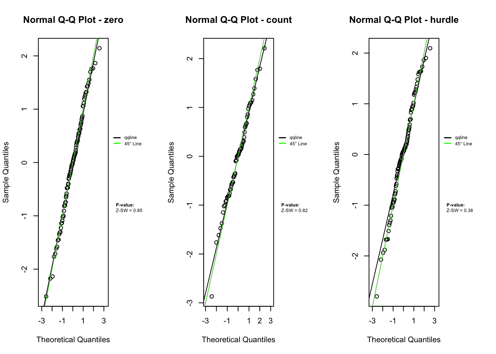
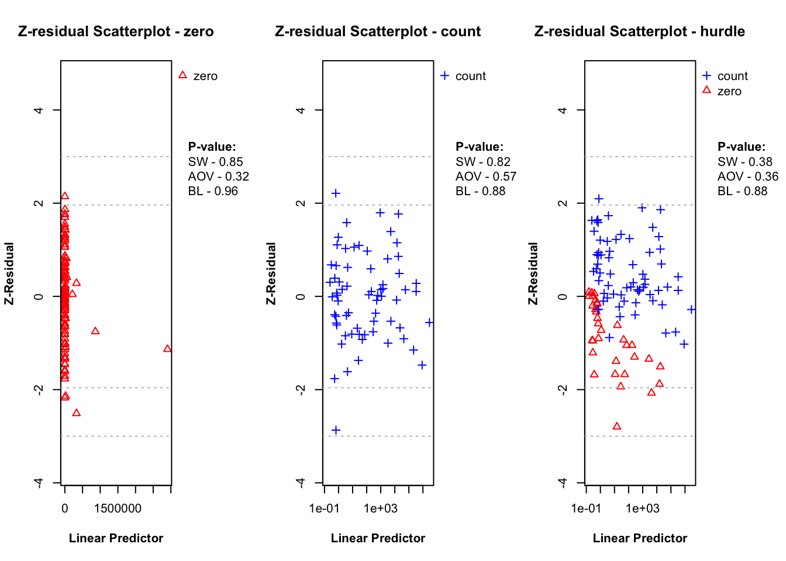
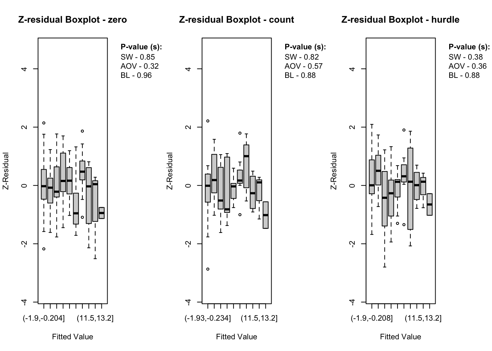
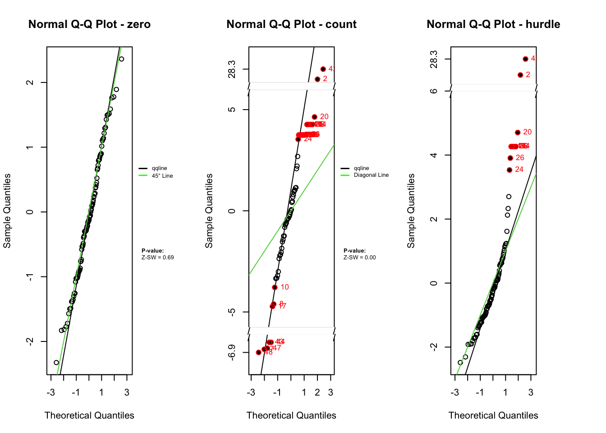
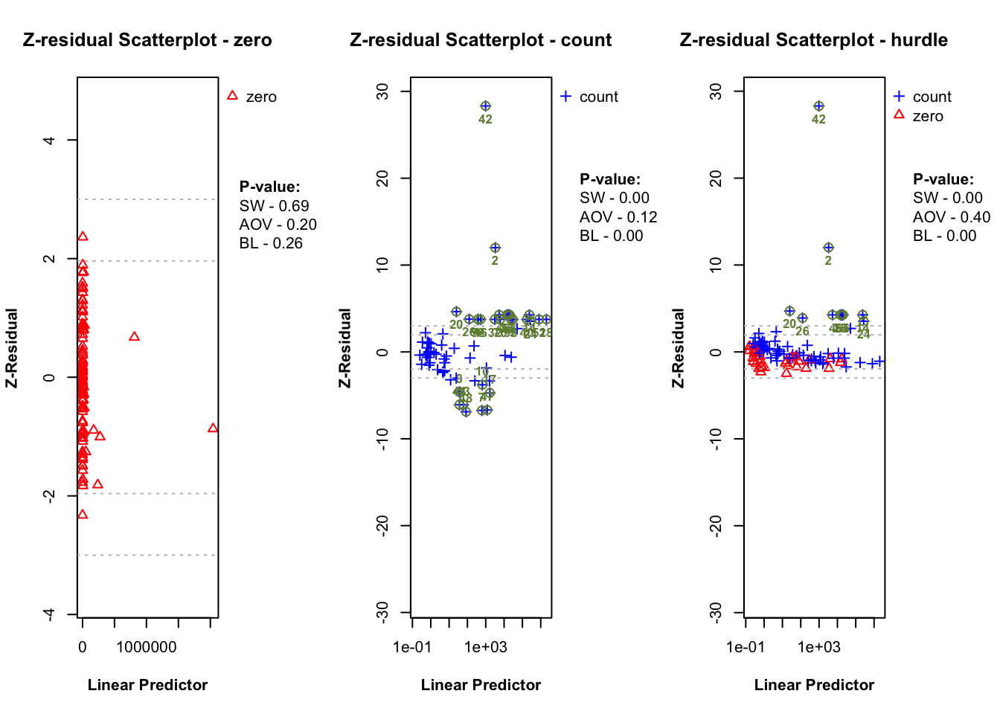
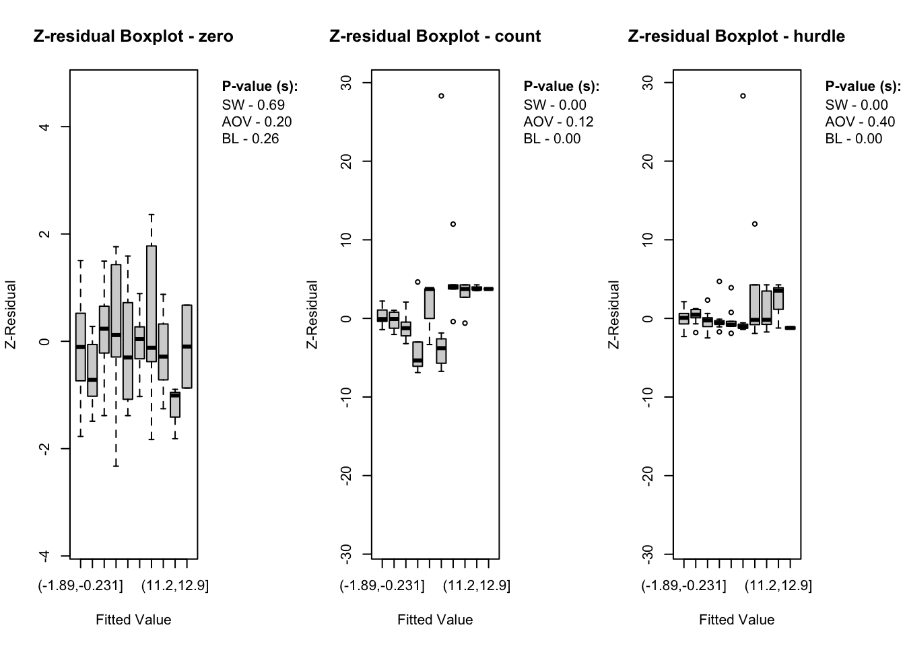

# Component-wise Z-residual Diagnosis for Bayesian Hurdle Models

## 1 Installing Zresidual and Other packages

### 1.1 Installing Z-residua from the source

### 1.2 Intalling and Loading R Packages used in this Demo

Code

``` r
# Vector of required packages
pkgs <- c(
  "brms","distributions3","foreach", "statip", "VGAM", "plotrix", "actuar",
  "stringr", "Rlab", "dplyr", "rlang", "tidyr",
  "matrixStats", "timeDate", "katex", "gt","loo"
)

# Check for missing packages and install if needed
missing_pkgs <- pkgs[!pkgs %in% installed.packages()[, "Package"]]
if (length(missing_pkgs) > 0) {
  message("Installing missing packages: ", paste(missing_pkgs, collapse = ", "))
  install.packages(missing_pkgs, dependencies = TRUE)
} else {
  message("All required packages are already installed.")
}

# Load all packages
invisible(lapply(pkgs, library, character.only = TRUE))

options(mc.cores = parallel::detectCores())
```

## 2 Introduction

This vignette demonstrates how to use the `Zresidual` package to compute
component-wise Z-residuals for diagnosing Bayesian hurdle models
([Mullahy 1986](#ref-Mullahy1986-em)), based on the output from the
`brms` package in R ([Bürkner 2017](#ref-Burkner2017-brms)) can be
calculated separately for the zero, count and hurdle components to
reveal potential model misspecifications. The examples illustrate the
practical use of these residuals for RPP ([Feng, Li, and Sadeghpour
2020](#ref-Feng2020)) diagnostics.

## 3 Definitions of Component-wise Z-residuals for Bayesian Hurdle Models

This section demonstrates the definiotns of component-wise posterior
predictive quantities including the posterior predictive PMF, survival
function, and RPP for Bayesian hurdle models. Hurdle models consist of
two parts:

- A **logistic component** modeling the probability of structural zeros.
- A **count component** modeling positive counts using a zero-truncated
  distribution.

Let $`C_i \in \{0, 1\}`$, where $`C_i = 1`$ indicates a non-zero value,
and $`C_i = 0`$ indicates a zero value for the \$i^\th\$ observations.
If $`C_i=1`$, the corresponding count model then operates on
$`y_i^+ \in \{1, 2, \dots\}`$, i.e., the positive counts only.

Using Bayesian estimation (e.g., via the `brms` package), we draw $`T`$
samples from the posterior distribution. Let $`\theta^{(t)}`$ denote the
\$t^\th\$ posterior draw, including component-specific parameters like:

- $`\pi^o_i`$ : the zero porbability,
- $`\mu_i^{(t)}, \phi^{(t)}`$ : parameters for the count component.

For a given observation $`y_i^\text{obs}`$, the component-wise posterior
predictive PMF and survival functions are defined below.

#### 3.0.1 **Hurdle Model:**

``` math
\begin{equation}
p_i^{\text{post}, \pi^o_irdle}(y_i^\text{obs}) = \frac{1}{T} \sum_{t=1}^T
\begin{cases}
{\pi^o_i}^{(t)} & \text{if } y_i^\text{obs} = 0, \\
(1 - {\pi^o_i}^{(t)}) \cdot\frac{p_i^\text{UT}(y_i^\text{obs} | \theta^{(t)})}{1 - p_i^\text{UT}(0 | \theta^{(t)})} & \text{if } y_i^\text{obs} =1, 2, \ldots,\\
0 & \text{otherwise.}
\end{cases}
\end{equation}
```
``` math
\begin{equation}
S_i^{\text{post}, \pi^o_irdle}(y_i^\text{obs}) = \frac{1}{T} \sum_{t=1}^T
\begin{cases}
1 & \text{if } y_i^\text{obs} < 0, \\
1-{\pi^o_i}^{(t)} & \text{if } 0 \le y_i^\text{obs} < 1, \\
(1 - {\pi^o_i}^{(t)}) \cdot \frac{S_i^\text{UT}(y_i^\text{obs} \mid \theta^{(t)})}{1-p_i^\text{UT}(0 \mid \theta^{(t)})} & \text{if } y_i^\text{obs} \ge 1.
\end{cases}
\end{equation}
```

#### 3.0.2 **Logistic Component:**

``` math
\begin{equation}
\label{componentwise_logistic_pmf}
p_i^{\text{post}, \text{logit}}(c_i^\text{obs}) = \frac{1}{T} \sum_{t=1}^T
\begin{cases}
{\pi^o_i}^{(t)} & \text{if } c_i^\text{obs} = 0, \\
1 - {\pi^o_i}^{(t)} & \text{if } c_i^\text{obs} = 1,\\
0 & \text{otherwise.}
\end{cases}
\end{equation}
```

``` math
\begin{equation}
\label{componentwise_logistic_survival}
S_i^{\text{post}, \text{logit}}(c_i^\text{obs}) = \frac{1}{T} \sum_{t=1}^T
\begin{cases}
1 & \text{if } c_i^\text{obs} < 0, \\
1-{\pi^o_i}^{(t)} & \text{if } 0 \le c_i^\text{obs} < 1, \\
0, & \text{if } c_i^\text{obs} \ge 1.
\end{cases}
\end{equation}
```

#### 3.0.3 **Count Compoenent:**

``` math
\begin{equation}
\label{componentwise_count_pmf}
p_i^{\text{post},\text{count}}({y_i^+}^\text{obs}) = \frac{1}{T} \sum_{t=1}^T
\begin{cases}
    \frac{p_i^\text{UT}({y_i^+}^\text{obs} \mid \theta^{(t)})}{1 - p_i^\text{UT}(0 \mid \theta^{(t)})}, & \text{ for } {y_i^{+}}^\text{obs} = 1,2,\ldots,\\
    0 & \text{ otherwise.}
\end{cases}
\end{equation}
```

``` math
\begin{equation}
\label{componentwise_count_survival}
S_i^{\text{post}, \text{count}}({y_i^+}^\text{obs}) = \frac{1}{T} \sum_{t=1}^T
\begin{cases}
    1 & \text{ if } {y_i^+}^\text{obs} < 1 \\
    \frac{S_i^\text{UT}({y_i^+}^\text{obs} \mid \theta^{(t)})}{1-p_i^\text{UT}(0 \mid \theta^{(t)})}, & \text{ if } {y_i^+}^\text{obs} \ge 1
\end{cases}
\end{equation}
```

where $`p_i^\text{UT}(. \mid \theta^{(t)})`$ and
$`S_i^\text{UT}(. \mid \theta^{(t)})`$ denote the PMF and survival
function of the untruncated count distribution, given the
component-specific posterior parameters $`\theta^{(t)}`$.

For any observed value $`y_i^\text{obs}`$, we define:
``` math
\begin{equation}
\label{eq:post_rpp}\text{rpp}_i(y_i^\text{obs} | \theta^{(t)}) = S_i(y_i^\text{obs} | \theta^{(t)}) + U_i \times p_i(y_i^\text{obs} | \theta^{(t)})
\end{equation}
```
where $`U_i \sim \text{Uniform}(0,1)`$. Here, $`y_i^\text{obs}`$ is the
observed value, which can refer to either the binary response $`C_i`$ or
the positive count $`{y_i^+}^\text{obs}`$, depending on the component
being evaluated. Then, the Z-residual of a discrete response variable
is,
``` math
\begin{equation}
\label{eq:z_residual}
z_i = -\Phi^{-1}(\text{rpp}_i(y_i^\text{obs}|\theta)) \sim N(0, 1)
\end{equation}
```
where (^{-1}(.)) is the quantile function of standard normal
distribution.

## 4 A Simulation Example

### 4.1 Model fitting with `brms`

To demonstrate how `Zresidual` works with hurdle models, we first
simulate data from a HNB model. This simulated dataset allows us to
evaluate how well the model and residual diagnostics perform when the
true data-generating process is known.

Code

``` r
# Simulation parameters
n <- 100
beta0 <- -1   # Intercept for hurdle (zero) part
beta1 <- -1  # Coefficient for hurdle part
alpha0 <- 2  # Intercept for count part
alpha1 <- 6  # Coefficient for count part
size <- 6      # Dispersion parameter for negative binomial

x <- rnorm(n) # Predictor

# Hurdle (zero) part
logit_p <- beta0 + beta1 * x
p_zero <- exp(logit_p) / (1 + exp(logit_p))
zeros <- rbinom(n, 1, p_zero)

# Count (non-zero) part
log_mu <- alpha0 + alpha1 * x
mu <- exp(log_mu)

# Generate from zero-truncated negative binomial
prob <- size / (size + mu)
y <- (1-zeros)*distributions3::rztnbinom(n, size, prob)

# A random error variable
z <- rnorm(n, mean = 0, sd = 1)

# Final dataset
sim_data <- data.frame(y = y, x = x, z = z)
```

This dataset includes a single continuous predictor `x`, a rando error
variable `z` and the outcome `y` is generated from a hurdle negative
binomial process. Note that the error variable is not included in
generating the `y` outcome variable. The hurdle (zero) part is modeled
with a logistic function and the count part uses a zero-truncated
negative binomial distribution.

Now, we use the `brms` package to fit a hurdle negative binomial model
to the simulated data.

Code

``` r
library(brms)
library(distributions3)
load(here::here("inst/extdata/fit_hnb.Rdata"))

#fit_hnb <- brm(bf(y ~ x + z, hu ~ x + z),
#               data = sim_data, 
#               family = hurdle_negbinomial())
```

The `hu` formula models the hurdle (zero) part, while the main formula
models the count component. The `family = hurdle_negbinomial()` tells
`brms` to use a hurdle model with a negative binomial distribution for
the non-zero counts. We use default parameter setting on this example to
fit the model.

### 4.2 Computing Z-residuals

In this example, we compute Z-residuals for the HNB model separately
for, logistic component (zero part) and count component using
[`Zresidual.hurdle.negbinomial()`](https://tiw150.github.io/Zresidual/reference/Zresidual.hurdle.negbinomial.md).
Apart from component-wise Z-residuals, the `Zresidual` package support
overall model Z-residual calculation. The package take `brms` fit as an
input and the `type` argument (`"zero", "count" or "hurdle"`) specifies
which component to use when calculating the residuals. By default,
Z-residuals are computed using the Importance Sampling Cross-Validation
(`iscv`) method based on randomized predictive p-values (RPP).
Alternatively, users can choose the standard Posterior RPP method by
setting `method = "post"`.

Code

``` r
library(matrixStats)
library(distributions3)
library(Zresidual)
zres_hnb_post_zero <- Zresidual.hurdle.negbinomial(fit_hnb, type = "zero", method = "rpost")
zres_hnb_post_count <- Zresidual.hurdle.negbinomial(fit_hnb, type = "count", method = "rpost")
zres_hnb_post_hurdle <- Zresidual.hurdle.negbinomial(fit_hnb, type = "hurdle", method = "rpost")
```

##### 4.2.0.1 **What the function returns**

The function
[`Zresidual.hurdle.negbinomial()`](https://tiw150.github.io/Zresidual/reference/Zresidual.hurdle.negbinomial.md)
(and other Z-residual computing functions) returns a matrix of
Z-residuals, with additional attributes. The returned object is of class
`zresid`, which includes metadata useful for diagnostic and plotting
purposes.

**Return Value**

A numeric matrix of dimension `n × nrep`, where `n` is the number of
observations in the data and `nrep` is the number of randomized
replicates of Z-residuals (default is 1). Each column represents a set
of Z-residuals computed from a RPP, using either posterior (`post`) or
importance sampling cross-validation (`iscv`) log predictive
distributions.

**Matrix Attributes**

The returned matrix includes the following attached attributes:

- `type`: The component of the hurdle model the residuals correspond to.
  One of “zero”, “count”, or “hurdle”.
- `zero_id`: Indices of observations where the response value was 0.
  Useful for separating diagnostics by zero and non-zero parts.
- `log_pmf`: A matrix of log predictive probabilities (log-PMF) per
  observation and posterior draw.
- `log_cdf`: A matrix of log predictive CDF values used in computing the
  RPPs.
- `covariates`: A data frame containing the covariates used in the model
  (excluding the response variable). This can be used for plotting or
  conditional diagnostics.
- `fitted.value`: The posterior mean predicted value for each
  observation depending on the type.

### 4.3 Diagnostic Tools for Z-Residuals

##### 4.3.0.1 Visualizing Z-residuals

The `Zresidual` package includes built-in plotting functions (QQ Plot,
Scatter Plot, Boxplot) to help diagnose model fit using Z-residuals.
These functions are designed to work directly with objects of class
`zresid` returned by functions like
[`Zresidual.hurdle.negbinomial()`](https://tiw150.github.io/Zresidual/reference/Zresidual.hurdle.negbinomial.md).
These plots help assess:

- Whether residuals are approximately standard normal (via QQ plots),
- Whether there are patterns in residuals across fitted values (which
  may suggest model misspecification),
- Whether residuals differ across covariates (optional extensions).

Code

``` r
par(mfrow = c(1,3))
qqnorm.zresid(zres_hnb_post_zero)
qqnorm.zresid(zres_hnb_post_count)
qqnorm.zresid(zres_hnb_post_hurdle)
```



Code

``` r
par(mfrow = c(1,3))
plot.zresid(zres_hnb_post_zero, X="lp", outlier.return = TRUE)
plot.zresid(zres_hnb_post_count, X="lp", outlier.return = TRUE, log = "x")
plot.zresid(zres_hnb_post_hurdle, X="lp", outlier.return = TRUE, log = "x")
```



Code

``` r
par(mfrow = c(1,3))
boxplot.zresid(zres_hnb_post_zero, X="lp")
boxplot.zresid(zres_hnb_post_count, X="lp")
boxplot.zresid(zres_hnb_post_hurdle, X="lp")
```



The diagnostic evaluations for the true model—comprising scatter plots,
Q-Q plots, and boxplots of Z-residuals—demonstrate that the model
adequately captures the data structure. Across the logistic, count, and
hurdle components, Z-residuals are evenly scattered around zero and
mostly fall within the range of -3 to 3, indicating no visible model
misfit. Complementary statistical tests, including the SW test for
normality, ANOVA for mean equality, and BL test for variance
homogeneity, all return p-values above the 0.05 threshold. This suggests
that the residuals follow a normal distribution and exhibit equal means
and variances across fitted value intervals. The Q-Q plots further
support normality through close alignment with the 45-degree reference
line, while the boxplots confirm consistent residual means across
partitions. Collectively, these diagnostics validate that the true model
satisfies key distributional assumptions and that the proposed
Z-residual methods are effective in detecting model adequacy.

The plotting functions in the Zresidual package are designed to be
flexible and lightweight, allowing users to quickly visualize residual
patterns across different components of hurdle models. These functions
support all customizable arguments in base `R` functions such as axes,
labels etc. by making them adaptable to a wide range of diagnostic
workflows. The
[`plot.zresid()`](https://tiw150.github.io/Zresidual/reference/plot.zresid.md)
function offers flexible diagnostic plotting for Z-residuals, supporting
various x-axes such as index, fitted values, and covariates. Both
[`plot.zresid()`](https://tiw150.github.io/Zresidual/reference/plot.zresid.md)
and
[`qqnorm.zresid()`](https://tiw150.github.io/Zresidual/reference/qqnorm.zresid.md)
automatically highlights outlier residuals that fall outside the typical
(or user specified)range making it easier to identify problematic
observations.

##### 4.3.0.2 Statistical Tests

In addition to visual diagnostics, the package offers formal statistical
tests to quantify deviations from normality or homogeneity of variance
in Z-residuals by taking an `zresid` class object as an input.

**Shapiro-Wilk Test for Normality (SW)**

Code

``` r
sw.test.zresid(zres_hnb_post_zero)
```

    [1] 0.852581

Code

``` r
sw.test.zresid(zres_hnb_post_count)
```

    [1] 0.8239379

Code

``` r
sw.test.zresid(zres_hnb_post_hurdle)
```

    [1] 0.3817335

**Analysis of Variance (ANOVA)**

Code

``` r
aov.test.zresid(zres_hnb_post_zero)
```

    [1] 0.3215278

Code

``` r
aov.test.zresid(zres_hnb_post_count)
```

    [1] 0.5749422

Code

``` r
aov.test.zresid(zres_hnb_post_hurdle)
```

    [1] 0.3600551

**Bartlett Test (BL)**

Code

``` r
bartlett.test.zresid(zres_hnb_post_zero)
```

    [1] 0.9599654

Code

``` r
bartlett.test.zresid(zres_hnb_post_count)
```

    [1] 0.8784607

Code

``` r
bartlett.test.zresid(zres_hnb_post_hurdle)
```

    [1] 0.8842395

These tests return standard `htest` or `aov` objects, making them easy
to report, summarize, or integrate into automated workflows. One
advantage of the visualization functions provided by the `Zresidual`
package is that they allow users to diagnose the model both visually and
using statistical tests simultaneously.

We might be also interested in comparing our HNB model to HP model
taking the HP model as misspecified model .

Code

``` r
load(here::here("inst/extdata/fit_hp.Rdata"))
#fit_hp <- brm(bf(y ~ x + z, hu ~ x + z),
#               data = sim_data, 
#               family = hurdle_negbinomial(),
#               prior = prior("normal(1000, 1)", class = "shape"))
```

This `prior("normal(1000, 1)", class = "shape")` is a very strong prior,
tightly centered around 1000. Its practical effect is to force the shape
parameter to be very large, which in turn makes the model behave almost
like a Poisson distribution for the positive counts (truncated part of
the hurdle model).

Code

``` r
zres_hp_post_zero <- Zresidual.hurdle.poisson(fit_hp, type = "zero", method = "rpost")
zres_hp_post_count <- Zresidual.hurdle.poisson(fit_hp, type = "count", method = "rpost")
zres_hp_post_hurdle <- Zresidual.hurdle.poisson(fit_hp, type = "hurdle", method = "rpost")
```

Code

``` r
par(mfrow = c(1,3))
qqnorm.zresid(zres_hp_post_zero)
qqnorm.zresid(zres_hp_post_count)
```

    Outlier Indices : 2 4 5 7 8 10 14 16 17 20 24 25 26 28 32 40 42 43 44 47 48 51 74 76 83 94 96 99 

Code

``` r
qqnorm.zresid(zres_hp_post_hurdle)
```



    Outlier Indices : 2 4 14 20 24 25 26 42 83 94 

Code

``` r
par(mfrow = c(1,3))
plot.zresid(zres_hp_post_zero, X="lp", outlier.return = TRUE)
plot.zresid(zres_hp_post_count, X="lp", outlier.return = TRUE, log = "x")
```

    Outlier Indices( count ): 2 4 5 7 8 10 14 16 17 20 24 25 26 28 32 40 42 43 44 47 48 51 74 76 83 94 96 99 

Code

``` r
plot.zresid(zres_hp_post_hurdle, X="lp", outlier.return = TRUE, log = "x")
```



    Outlier Indices( hurdle ): 2 4 14 20 24 25 26 42 83 94 

Code

``` r
par(mfrow = c(1,3))
boxplot.zresid(zres_hp_post_zero, X="lp")
boxplot.zresid(zres_hp_post_count, X="lp")
boxplot.zresid(zres_hp_post_hurdle, X="lp")
```



While the logistic component shows randomly scattered residuals and
normal Q-Q alignment, supported by non-significant p-values, the count
and hurdle components display clear signs of misspecification. These
include banded residual patterns, heavy tails, Q-Q deviations, and
significant p-values from the SW, ANOVA, and BL tests. The overall
hurdle model diagnostics reflect similar issues but cannot isolate the
source of misfit. This highlights a key advantage of component-wise
residual analysis: it reveals that the logistic sub-model is correctly
specified, while the count component is not. Such separation enables
more precise identification and correction of modeling issues.

\##Real Data Example for Illustration and Demonstration

## 5 Other Functions

In addition to Z-residual computation and visualization, the `Zresidual`
package provides several utility functions to support deeper model
diagnostics and probabilistic analysis including functions for
calculating the logarithmic predictive p-values
([`post_logrpp()`](https://tiw150.github.io/Zresidual/reference/post_logrpp.md),
[`iscv_logrpp()`](https://tiw150.github.io/Zresidual/reference/iscv_logrpp.md)).
The package also includes dedicated functions to compute the logarithmic
PDFs and CDFs for supported distributions. These can be used to manually
inspect likelihood components or to derive custom model evaluation
metrics. The log-scale calculations offer improved numerical stability,
especially when dealing with small probabilities. These tools integrate
seamlessly with outputs from Bayesian models fitted using `brms`,
maintaining compatibility and flexibility. Together, they extend the
package’s functionality beyond residual analysis, supporting a
comprehensive and rigorous approach to Bayesian model checking.

## 6 References

Bürkner, Paul-Christian. 2017. “brms: An R Package for Bayesian
Multilevel Models Using Stan.” *Journal of Statistical Software* 80 (1):
1–28. <https://doi.org/10.18637/jss.v080.i01>.

Feng, Cindy, Longhai Li, and Alireza Sadeghpour. 2020. “A Comparison of
Residual Diagnosis Tools for Diagnosing Regression Models for Count
Data.” *BMC Medical Research Methodology* 20 (1): 175.
<https://doi.org/10.1186/s12874-020-01055-2>.

Mullahy, John. 1986. “Specification and Testing of Some Modified Count
Data Models.” *J. Econom.* 33 (3): 341–65.
